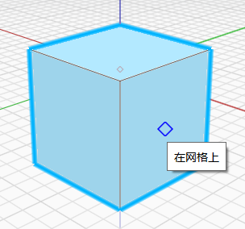

# Meshes

Starting in v17.0, FormIt offers a new type of geometry: Meshes.

Meshes are lightweight representations of standard FormIt Objects, and are great for improving the performance of high-polygon geometry like furniture or 3D entourage like people, trees, cars, and signage. Meshes are also great for complex DWG geometry that might otherwise affect FormIt's performance.

Objects can be converted to Meshes, and Meshes can be converted back to Objects without losing any data. Some file types are automatically imported as Meshes, like OBJ, STL, and DWG. Learn more about converting between types, and other benefits and limitations of Meshes below.

## Converting Objects to Meshes

Any combination of vertices, edges, faces, or solid bodies can be converted to Meshes.

Simply select Objects, and either use shortcut OM \(Objects to Meshes\) or right-click and select Objects to Meshes in the Context Menu:

Once the Objects have been converted to Meshes, you'll see a confirmation message at the top of the screen:

**When converting Objects to Meshes:**

* Edges that were smoothed on the Objects will remain smoothed in the resulting Meshes.
* Material orientations on the Objects will remain unchanged in the resulting Meshes.
* A Mesh is created for every material applied. For example, if you convert a single cube painted 6 different colors, you'll get 6 different Meshes.
  * Converting back to an Object will re-seal the individual meshes back into a solid body.
* Selecting a solid body will convert and replace the entire body with a Mesh, but selecting individual edges or vertices owned by a solid will create a new Mesh on top of the existing geometry, without affecting the original body.
* Converting a set of edges or vertices will create a single Linemesh \(a mesh made of edges\) or a single Pointmesh \(a mesh made of points\), which means you won't be able to select individual edges or vertices once they've been combined into a single Mesh. Convert them back to Objects if you want to adjust the position of a single element.

**Converting Grouped geometry to Meshes:**

* Meshes become even more powerful when you can convert an entire Group and all of its nested Groups into Meshes.
* Groups and their nested contents can be converted to Groups by using a plugin:
  * Look for the Plugin Manager icon on the right side of the application:
    *  
  * Find the "Mesh + Unmesh All" plugin, and click the checkbox to install it:
    *  
  * The Mesh + Unmesh All plugin will load. Simply select a Group containing Objects you want to convert to Meshes, and click Mesh All.
    *  
  * When converting nested Objects or Meshes with this Plugin, you'll see an update message at the top of the screen telling you how many Groups and instances of Groups were affected by the operation:

## Interacting With Meshes

**Because of their lightweight nature, Meshes have certain limitations and behaviors:**

* You won't be able to edit the individual faces, edges, or vertices of a Mesh.
  * However, you can repaint Meshes and move individual Meshes created as a result of different materials applied to faces \(see above\).
* Snapping to Meshes is limited to the faces and vertices of Meshes. For performance, snapping and inferencing will not work with edges of Meshes.
  * However, DWG files converted to Meshes \(a different type of mesh known as a Linemesh\) will retain the ability to snap to and inference to Mesh edges.
* Meshes cannot have Levels applied to them.
* Meshes will not report watertight or backface issues. Convert them back to Objects to see whether they are watertight or not. 
  * Objects that were watertight before conversion to a Mesh will remain watertight when converted back to an Object.
* Meshes cannot be used in advanced modeling operations, like Solid Join/Cut, 3D Shell, 3D Offset, Fillet, Loft, Sweep, or Cover.

Otherwise, Meshes will display and behave like any other FormIt Object: placed in Groups, assigned to Layers, visualized in Scenes, used for Analysis, etc.

**You'll know you're interacting with a Mesh if the tooltip reports "On Mesh" or if the Properties Panel reports a Mesh:**

**Some file types are automatically imported as Meshes to improve performance:**

* STL and OBJ files, which could contain dense geometry like pointclouds from other applications, are automatically imported as Meshes.
* DWG files, which could contain millions of small edge segments on high-quality curves, are automatically imported as Meshes.

## Converting Meshes Back to Objects

Simply select Meshes, and either use shortcut MO \(Meshes to Objects\) or right-click and select Meshes to Objects in the Context Menu:

Once the objects have been converted to Meshes, you'll see a confirmation message at the top of the screen:

**When converting Meshes back to Objects:**

* Any Objects that were previously solid/watertight before converting to a Mesh will be rejoined into a watertight solid when converting back to an Object.
* Converting a series of edges \(for example from a DWG file\) or a series of vertices \(for example from a pointcloud\) to a Mesh and back will automatically put the unmeshed Objects into a Group.
  * This prevents the new edges or vertices from merging with other geometry which could have adverse effects and impact performance.
  * Simply can Ungroup the resulting Group to release the edges and/or vertices.

**Converting Grouped Meshes back to Objects:**

* See the instructions above to use the Mesh + Unmesh All plugin to convert Groups and their nested Meshes back into Objects.

