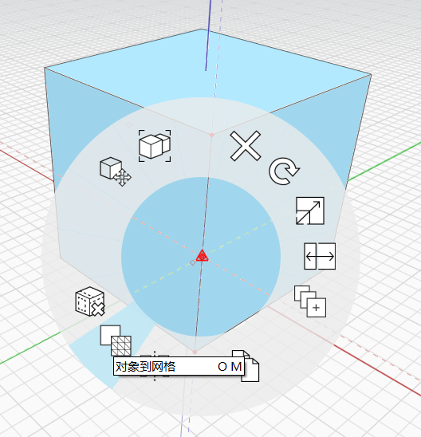

# 網格

從 v17.0 開始，FormIt 提供新的幾何圖形類型：網格。

網格是標準 FormIt 物件的輕量表現法，對於提升高度多邊形幾何圖形 \(例如人、樹、車和告示牌等家具或 3D 點景\) 的效能非常有用。網格也適用於複雜的 DWG 幾何圖形，這些幾何圖形可能會影響 FormIt 的效能。

物件可以轉換為網格，網格也可以轉換回物件，不會遺失任何資料。某些檔案類型會自動匯入為網格，例如 OBJ、STL 和 DWG。請在下面進一步了解在類型之間轉換，以及網格的其他優點和限制。

### 將物件轉換為網格

頂點、邊、面或實體本體的任意組合都可轉換為網格。

只要選取物件，然後使用快速鍵 OM \(物件變網格\)，或按一下右鍵，然後在關聯式功能表中選取「物件變網格」：

將物件轉換為網格後，您會在螢幕頂端看到確認訊息：

**將物件轉換為網格時：**

* 在物件上平滑處理的邊在產生的網格中會保持平滑。
* 物件上的材料方位在產生的網格中將保持不變。
* 每種套用的材料都會建立網格。例如，如果轉換繪製 6 種不同顏色的單一立方體，您會得到 6 種不同的網格。
   * 轉換回物件會將個別網格重新密封回實體本體。
* 選取實體本體會轉換整個本體，並用網格取代整個本體，但選取實體擁有的個別邊或頂點，將在既有幾何圖形的頂部建立新網格，而不會影響原始本體。
* 轉換一組邊或頂點會建立單一 Linemesh \(由邊構成的網格\) 或單一 Pointmesh \(由點構成的網格\)，這表示一旦將個別邊或頂點合併為單一網格後，就無法選取這些邊或頂點。如果您要調整單一元素的位置，請將其轉換回物件。

**將群組的幾何圖形轉換為網格：**

* 如果您將整個群組及其所有巢狀群組轉換為網格，網格功能會更強大。
* 使用外掛程式，可將群組及其巢狀內容轉換為群組：
   * 在應用程式右側尋找 Plugin Manager 圖示：
      * 
   * 找到「Mesh + Unmesh All」外掛程式，然後按一下勾選方塊以安裝：
      * 
   * 將載入「Mesh + Unmesh All」外掛程式。只需選取包含要轉換為網格之物件的群組，然後按一下「Mesh All」。
      * 
   * 使用此外掛程式轉換巢狀物件或網格時，您會在螢幕頂端看到更新訊息，告知您有多少群組和群組實體受此作業影響：

### 與網格互動

**由於網格的輕量性質，因此有某些限制和行為：**

* 您無法編輯網格的個別面、邊或頂點。
   * 但是，您可以重新繪製網格，並移動因套用至面的不同材料而建立的個別網格 \(請參閱上文\)。
* 鎖點至網格僅限於網格的面和頂點。因為效能因素，網格的邊無法使用鎖點和推論。
   * 但是，轉換為網格 \(稱為 Linemesh 的不同網格類型\) 的 DWG 檔案將保有鎖點至網格邊和推論至網格邊的功能。
* 網格無法套用樓層。
* 網格不會報告防水或背面問題。將網格轉換回物件，可查看它們是否防水。
   * 轉換回網格之前防水的物件，在轉換回物件後還是維持防水。
* 網格無法用於進階塑型作業，例如「實體接合/切割」、「3D 薄殼」、「3D 偏移」、「圓角」、「斷面混成」、「掃掠」或「覆蓋」。

除此之外，網格會像其他任何 FormIt 物件一樣顯示和運作：放置在群組中、指定給圖層、在場景中視覺化、用於分析等。

**如果工具提示報告「在網格上」，或「性質」面板顯示網格，您會知道您正在與網格互動：**

**某些檔案類型會自動匯入為網格以提升效能：**

* STL 和 OBJ 檔案 \(可能包含例如來自其他應用程式的點雲的密集幾何圖形\) 會自動匯入為網格。
* DWG 檔案 \(可在高品質曲線上包含數百萬條小邊緣線段\) 會自動匯入為網格。

### 將網格轉換回物件

只需選取網格，然後使用快速鍵 MO \(網格變物件\)，或按一下右鍵，然後在關聯式功能表中選取「網格變物件」：

將物件轉換為網格後，您會在螢幕頂端看到確認訊息：

**將網格轉換回物件時：**

* 在轉換為網格之前就已經是實體/防水的任何物件，在轉換回物件時，都會重新接合為防水實體。
* 將一系列邊 \(例如從 DWG 檔案\) 或一系列頂點 \(例如從點雲\) 轉換為網格又轉換回來，會自動將未建立網格的物件放到群組中。
   * 這可避免新的邊或頂點與其他幾何圖形合併，進而產生不利影響並影響效能。
   * 只需將產生的群組解除群組，即可釋放邊和/或頂點。

**將群組的網格轉換回物件：**

* 請參閱上述指示，使用「Mesh + Unmesh All」外掛程式將群組及其巢狀網格轉換回物件。

