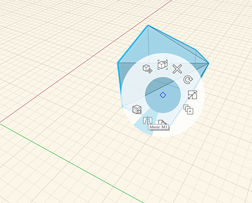

### Mirror
---
> Mirror an object.

---

To mirror an object, double click to select entire object. To start the mirror right click and choose mirror or type **MI**(1). The plane that appears shows the axis the object will be mirrored on (2). The plane can be moved or rotated to customize the axis of the mirror. 

1. 
2. 
3. 