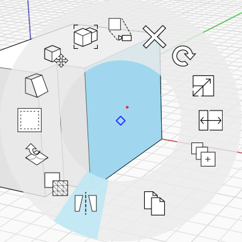
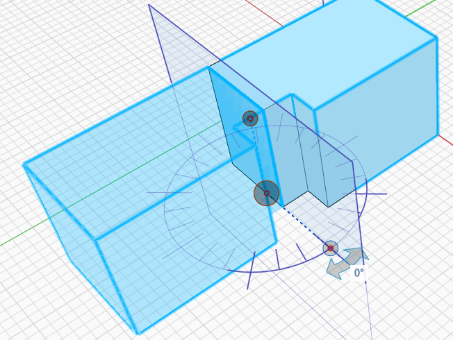

# Reflejar

Utilice la herramienta Reflejar para crear un duplicado reflejado de un objeto.

Para reflejar un objeto, realice lo siguiente:

1. Haga doble clic para seleccionar un único objeto o haga clic una vez para seleccionar un grupo.
2. Haga clic con el botón derecho y seleccione la herramienta Reflejar en el menú contextual o escriba el método abreviado de teclado **MI**.
3. Se muestran un plano y el eje en el que se reflejará el objeto. El plano se puede desplazar o rotar para personalizar el eje del reflejo.
4. Cuando haya terminado de ajustar el plano del objeto reflejado, haga clic en cualquier lugar fuera de la selección.

