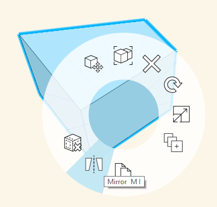
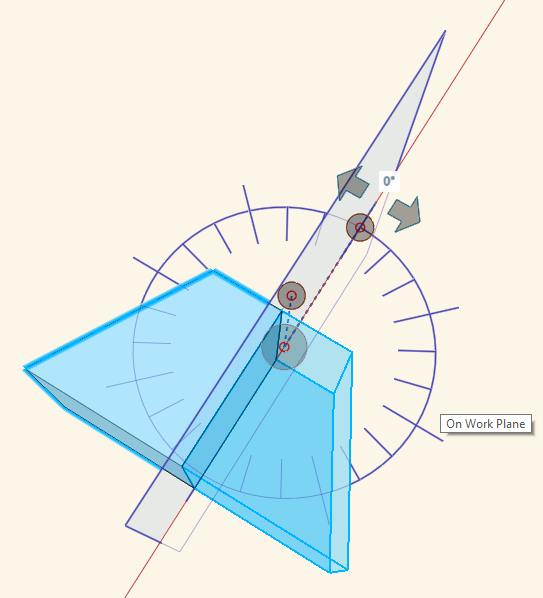

# Mirror

Use the Mirror tool to create a mirrored duplicate of an object.

To mirror an object: 

1. Double-click to select a single object, or single-click to select a group. 
2. Right-click and choose the Mirror tool from the context menu, or type the keyboard shortcut, **MI**. 
3. A plane displays and shows the axis the object will be mirrored on. The plane can be moved or rotated to customize the axis of the mirror.
4. When you are done adjusting the plane of your mirrored object, click anywhere outside of the selection.

