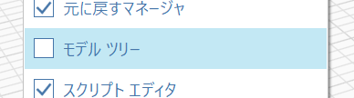
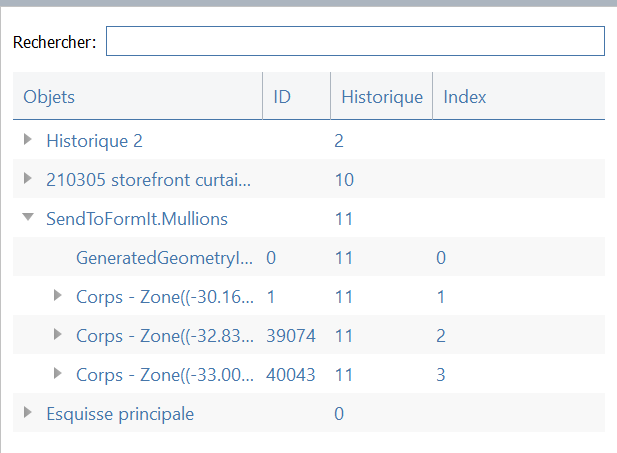

# Model Tree

The Model Tree provides a way to view the topological hierarchy of your FormIt model.

Enable the Model Tree by going to the Window menu, and checking the box next to Model Tree.

Inside the Model Tree, each Group is identified as a History, since each Group has its own command history, or Undo/Redo stack. 

Within each History, you'll see a list of nested Groups, instances, or geometric objects like bodies.

You can also view non-geometric attributes \(string attributes\) attached to FormIt objects using the Model Tree. [You can place string attributes on Groups created by the SendToFormIt node using Dynamo](https://formit.autodesk.com/page/formit-dynamo#dynamo-formit-nodes).

