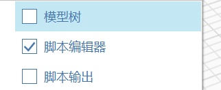
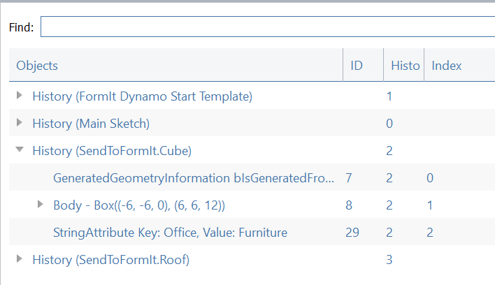

# 模型樹

模型樹提供檢視 FormIt 模型拓樸架構的方式。

移至「視窗」功能表，並勾選「模型樹」旁邊的方塊，以啟用「模型樹」。

在模型樹中，每個群組都會被識別為一個「歷程」，因為每個群組都有其自己的指令歷程或「退回/重做」堆疊。

在每個歷程中，您將看到巢狀群組、實體或幾何物件 \(例如本體\) 的清單。

您也可以使用模型樹檢視貼附至 FormIt 物件的非幾何屬性 \(字串屬性\)。[您可以使用 Dynamo 將字串屬性放在由 SendToFormIt 節點建立的群組上](https://formit.autodesk.com/page/formit-dynamo#dynamo-formit-nodes)。

