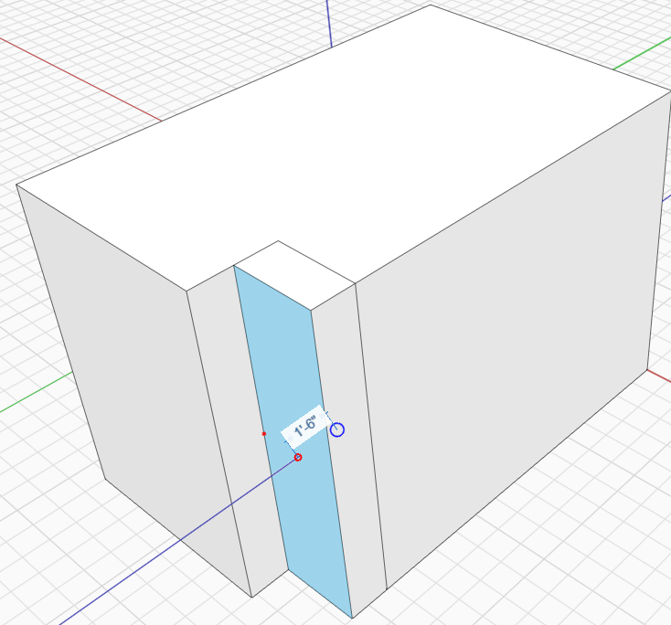
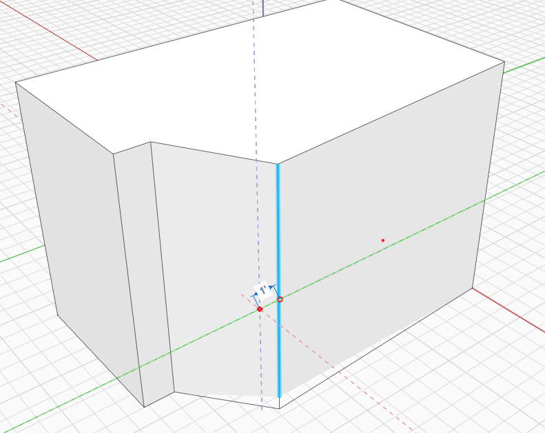

# Изменение граней, ребер и точек

Применение команд выдавливания и вытягивания к размещенным объектам открывает множество интересных возможностей проектирования. Выбрать отдельную вершину, ребро, грань или сеть можно одним щелчком.

## Изменение граней

1. Щелкните грань.
2. FormIt автоматически переключится в режим перетаскивания грани или выдавливания.
3. Щелкните в пустом пространстве, чтобы определить начальную точку операции.
4. После щелчка можно выполнить привязку к другим объектам для выравнивания нужной грани.
5. Как и при перемещении, можно щелкнуть **временный размер** или просто начать вводить значение, чтобы определить расстояние перемещения.

Кроме того, можно удалить грань с помощью клавиши **DELETE** или команды «Удалить» в контекстном меню.

Удалить грань также можно, **щелкнув правой кнопкой мыши и нажав кнопку X**.

## Изменение ребер

1. Щелкните ребро.
2. FormIt автоматически переключится в режим перемещения.
3. Наведите курсор на точку в пространстве, с которой требуется начать операцию перемещения.
4. Щелкните и начните перетаскивать ребро для изменения формы.

## Изменение точек

1. Щелкните один из углов любого из кубов.
2. Как и при работе с ребром, при перетаскивании точки вдоль одной из осей происходит переопределение формы. [Далее: «Непропорциональное масштабирование»](non-uniform-scale.md)

 (1).png>)
