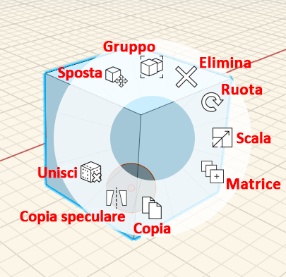
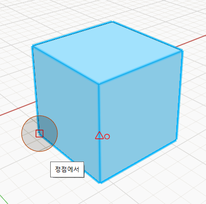
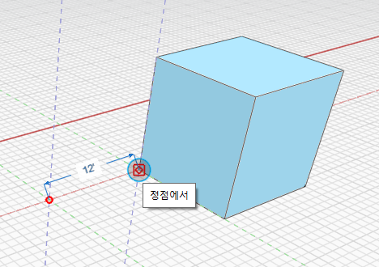

# Objekt verschieben

1. **Doppelklicken** Sie auf ein Objekt, um es vollständig auszuwählen \(durch einfaches Klicken wird eine Fläche, eine Kante oder ein Scheitelpunkt ausgewählt, wie unter [Ändern von Flächen, Kanten und Punkten](modifying-faces-edges-and-points.md) beschrieben\)
2. **Klicken Sie mit der rechten Maustaste** auf den Würfel, und wählen Sie das Werkzeug **Gruppe verschieben** aus dem **Kontextmenü** aus. 
3. Klicken Sie und ziehen Sie den Kreis an die Stelle, die als **Fangpunkt verwendet werden soll.** 
4. **Klicken Sie und beginnen Sie mit dem Ziehen**. Dadurch verschieben Sie das Objekt, wobei der zuvor ausgewählte Punkt als Fangpunkt verwendet wird.   
5. Drücken Sie die **Tabulatortaste.** Sie können jetzt den genauen Abstand zum Verschieben des Objekts entlang der aktuellen Achse eingeben.

\*\*\*\*

