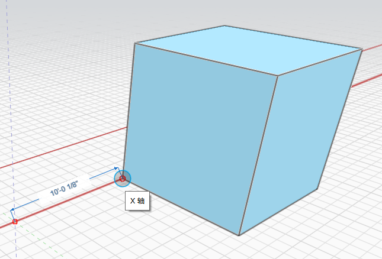

# Przesuwanie obiektu

1. **Kliknij dwukrotnie**, aby wybrać cały obiekt \(kliknij jednokrotnie, aby wybrać powierzchnię, krawędź lub wierzchołek — opisano to w temacie [Modyfikowanie powierzchni, krawędzi i punktów](modifying-faces-edges-and-points.md)\)
2. **Kliknij prawym przyciskiem myszy** sześcian i wybierz narzędzie **Przesuń grupę** z **menu kontekstowego**. 
3. Kliknij i przesuń okrąg do punktu, który posłuży jako **punkt przyciągania.** 
4. **Kliknij, a następnie rozpocznij przeciąganie**. Teraz przesuwasz obiekt, a wstępnie wybrany punkt jest teraz punktem przyciągania. 
5. Naciśnij klawisz **Tab.** Można teraz wpisać żądaną odległość, aby przesunąć obiekt wzdłuż bieżącej osi.

\*\*\*\*

