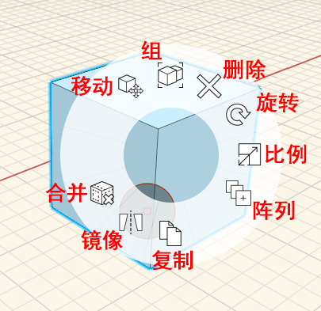

# Mover objeto

1. **Haga doble clic** para seleccionar un objeto completo \(haga clic una vez para seleccionar una cara, un borde o un vértice, lo que se describe en [Modificación de caras, bordes y puntos](modifying-faces-edges-and-points.md)\)
2. **Haga clic con el botón derecho** en el cubo y seleccione la herramienta **Mover grupo** en el **menú contextual**. 
3. Haga clic en el círculo y desplácelo al punto que utilizará como punto de forzado de cursor **.** 
4. **Haga clic y, a continuación, empiece a arrastrar**. Está desplazando el objeto; el punto preseleccionado será ahora el punto de forzado de cursor. 
5. Pulse la tecla **Tab.** Ahora puede introducir una distancia específica para desplazar ese objeto a lo largo del eje actual.

\*\*\*\*

