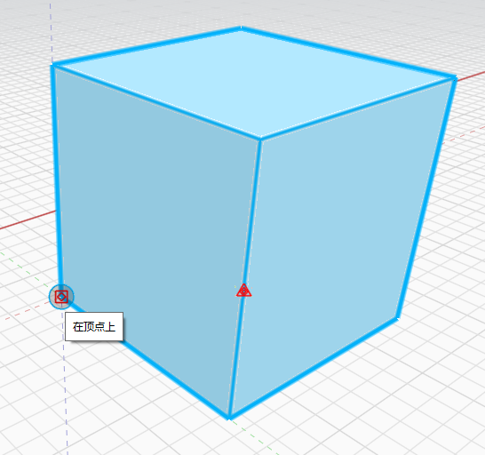

# 移动对象

1. **双击**以选择整个对象（单击以选择面、边或顶点，将在[修改面边和点](modifying-faces-edges-and-points.md)中进行介绍。\)
2. 在立方体上**单击鼠标右键**，然后从**上下文菜单**中选择**“移动组”**工具。
3. 单击圆并将其移动到将要用作**捕捉点的点。** 
4. **单击，然后开始拖动**。您现在正在移动对象，预选的点现在将成为捕捉点。
5. 按 **Tab 键。**现在，可以键入特定距离，来沿当前轴移动该对象。

\*\*\*\*

