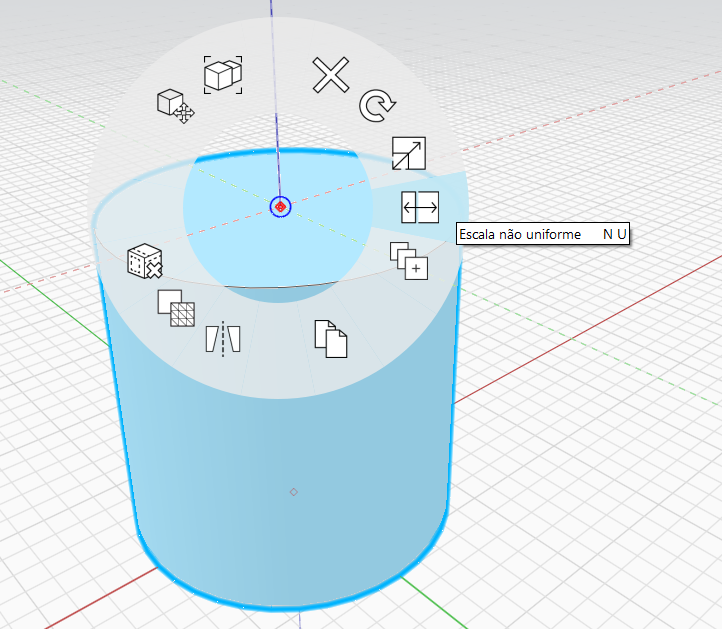
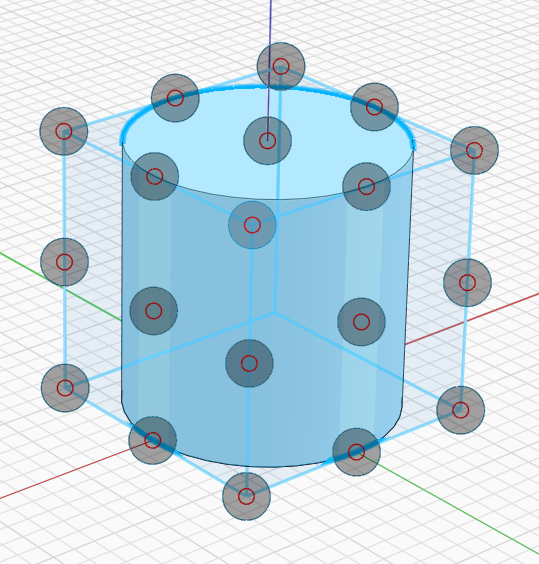
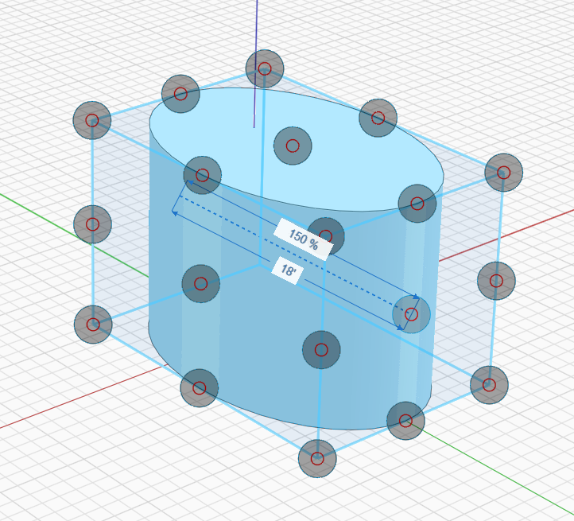
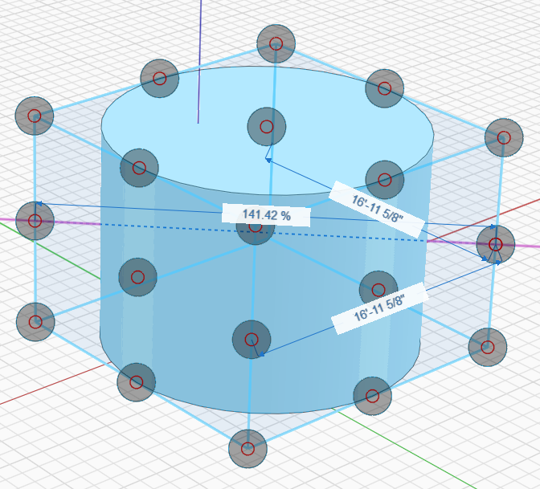
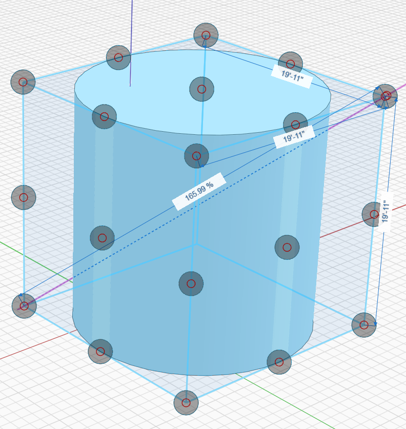

# Escala não uniforme

**Use Escala não uniforme para esticar objetos em 1, 2 ou 3 cotas.**

Selecione qualquer combinação de arestas, faces, sólidos, malhas ou grupos e acesse Escala não uniforme usando o atalho de teclado **NU** ou a opção Menu de contexto:

**Uma vez ativada a opção, você verá uma série de alças que podem ser usadas para dimensionar de forma não uniforme o objeto em 1, 2 ou 3 eixos simultaneamente.**

Para maior clareza, somente as alças voltadas para a câmera serão desenhadas. Orbite em torno do objeto se você precisar ajustar uma alça no outro lado.

Após clicar em uma alça, você verá uma série de caixas de texto editáveis onde é possível ajustar a escala por porcentagem ou distância:

**Quando as caixas de cota estiverem visíveis, será possível:**

* Começar a digitar um número para editar automaticamente a caixa de porcentagem e especificar um fator de escala.
   * Inserir um número negativo inverterá a direção da escala.
* Ou clicar para definir temporariamente a localização da alça e, em seguida, clicar na caixa que contém a cota para dimensionar por distância.
* Clicar fora do espaço ou pressionar Esc para concluir a operação Escala não uniforme.

**O dimensionamento em uma das alças de aresta de canto respeitará a proporção das cotas adjacentes:**

* Comece a digitar um número para editar o valor de porcentagem.
* Ou clique para definir temporariamente a localização da alça e, em seguida, clique em uma das duas caixas de cota para dimensionar por distância.
* Clique fora do espaço ou pressione Esc para concluir a operação Escala não uniforme.

**De forma similar, a escala em uma das alças de canto respeitará a proporção de toda a forma e, de forma eficaz, dimensionará uniformemente:**

* Comece a digitar um número para editar o valor de porcentagem.
* Ou clique para definir temporariamente a localização da alça e, em seguida, clique em uma das três caixas de cota para dimensionar por distância.
* Clique fora do espaço ou pressione Esc para concluir a operação Escala não uniforme.

