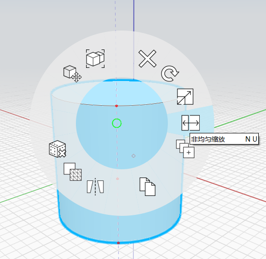

# 비균일 축척

**비균일 축척을 사용하여 객체를 1, 2 또는 3차원으로 연장할 수 있습니다.**

모서리, 면, 솔리드, 메쉬 또는 그룹의 조합을 선택하고 키보드 바로 가기 **NU**를 사용하거나 상황에 맞는 메뉴 옵션에서 비균일 축척에 액세스합니다.

**활성화되면 1축, 2축 또는 3축에서 객체를 동시에 비균일하게 축척하는 데 사용할 수 있는 일련의 그립이 표시됩니다.**

명확히 표시하기 위해 카메라를 향하는 그립만 그려집니다. 반대쪽의 그립을 조정해야 하는 경우 객체 궤도를 이동합니다.

그립을 클릭하면 일련의 편집 가능한 텍스트 상자가 표시됩니다. 이 텍스트 상자에서 비율이나 거리로 축척을 조정할 수 있습니다.

**치수 상자가 표시되면 다음을 수행할 수 있습니다.**

* 숫자 입력을 시작하여 백분율 상자를 자동으로 편집하고 축척 비율을 지정합니다.
   * 음수를 입력하면 축척 방향이 반전됩니다.
* 또는 클릭하여 그립 위치를 임시로 설정한 다음, 치수가 포함된 상자를 클릭하여 거리로 축적합니다.
* 공간을 클릭하거나 Esc 키를 눌러 비균일 축척 작업을 마칩니다.

**코너 모서리 그립 중 하나의 축척을 조정하면 인접 치수의 종횡비가 적용됩니다.**

* 숫자 입력을 시작하여 백분율 값을 편집합니다.
* 또는 클릭하여 그립 위치를 임시로 설정한 다음, 두 개의 치수 상자 중 하나를 클릭하여 거리로 축척합니다.
* 공간을 클릭하거나 Esc 키를 눌러 비균일 축척 작업을 마칩니다.

**마찬가지로 코너 그립 중 하나를 축척하면 전체 모양의 종횡비가 적용되며 효과적으로 균일하게 축척됩니다.**

* 숫자 입력을 시작하여 백분율 값을 편집합니다.
* 또는 클릭하여 그립 위치를 임시로 설정한 다음, 세 개의 치수 상자 중 하나를 클릭하여 거리로 축척합니다.
* 공간을 클릭하거나 Esc 키를 눌러 비균일 축척 작업을 마칩니다.

