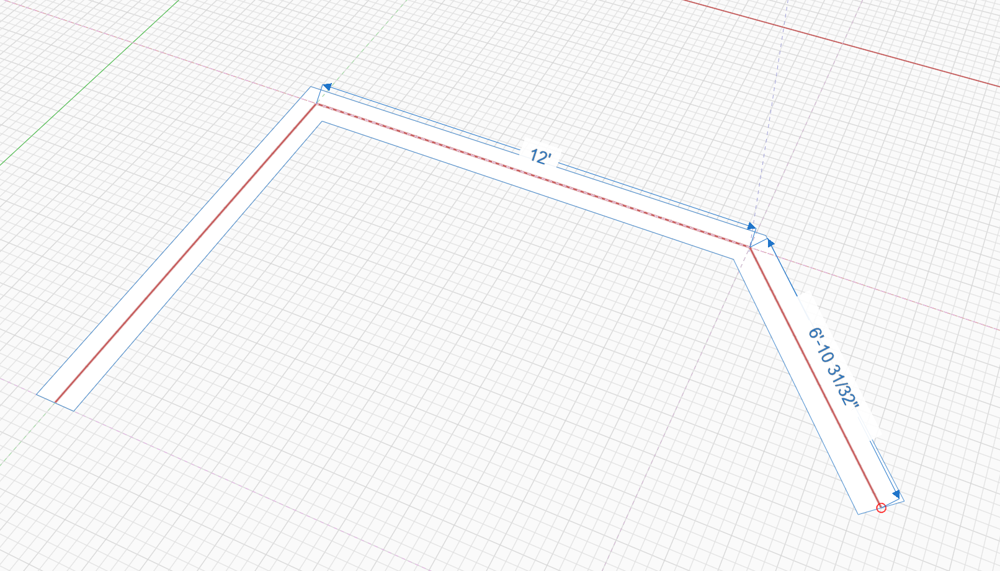
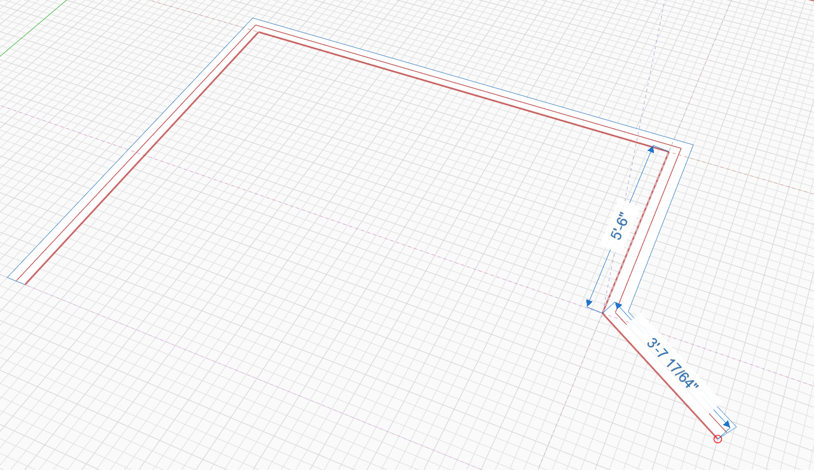
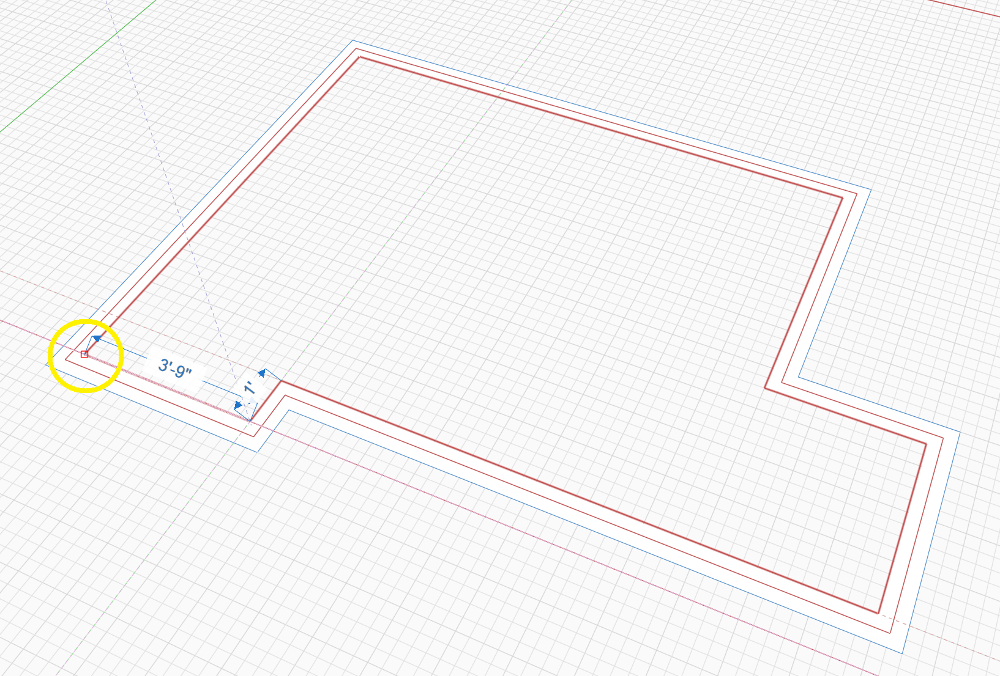
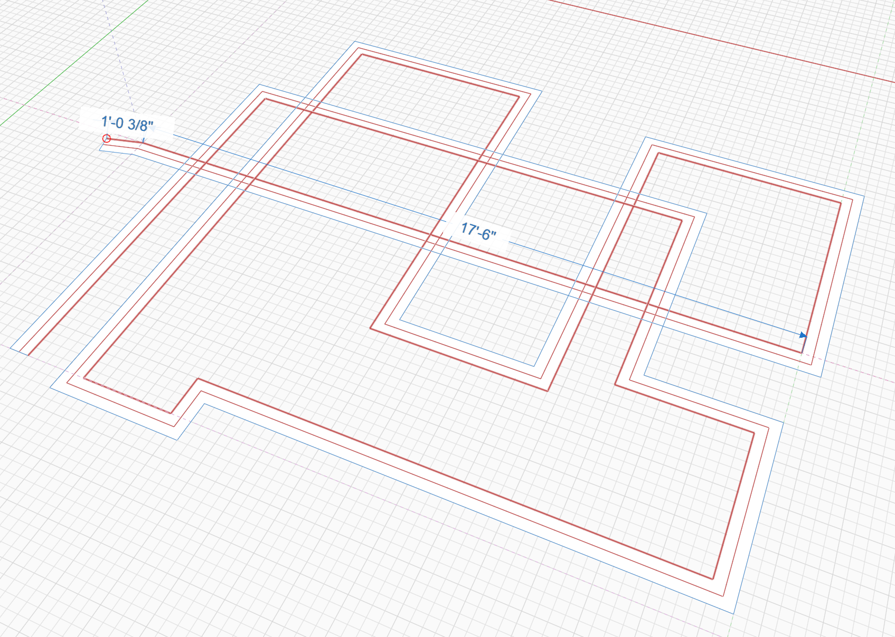
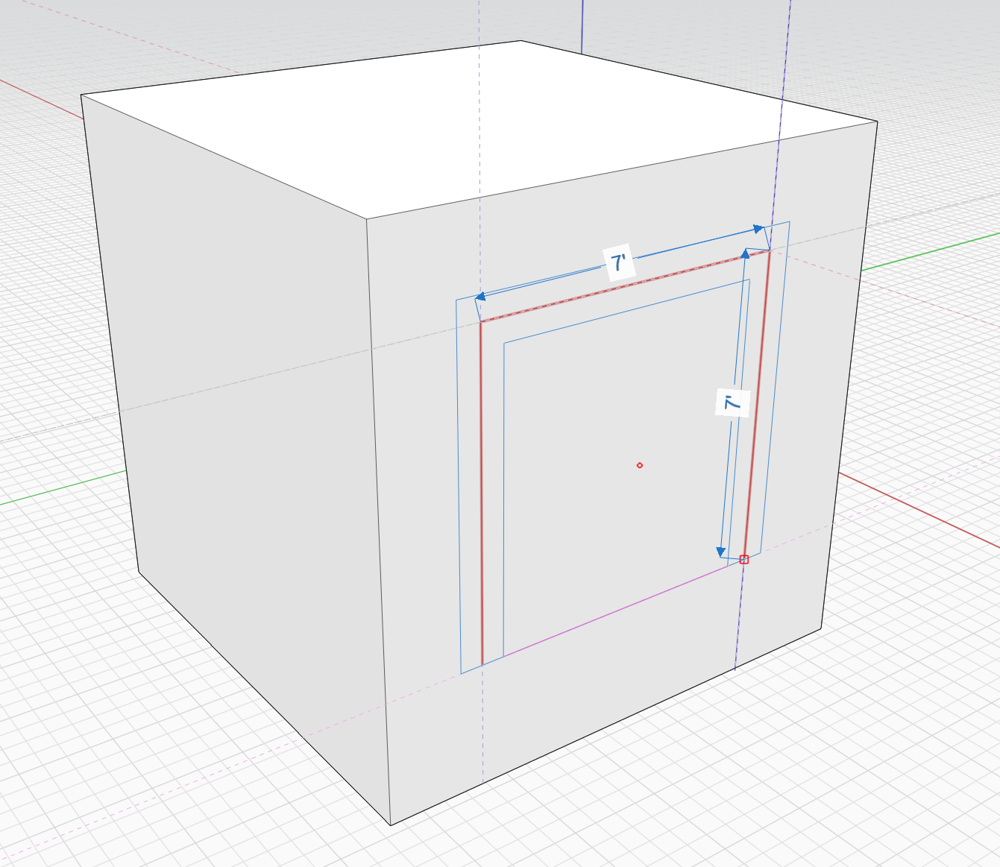
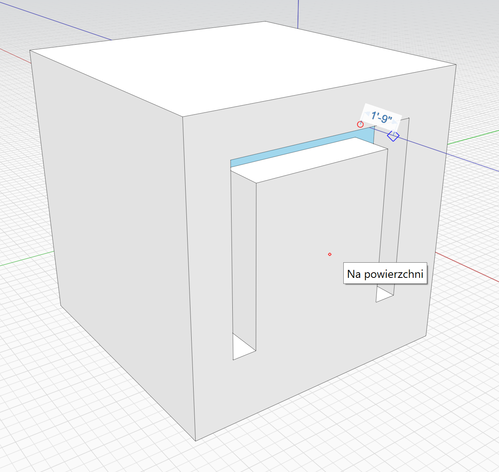
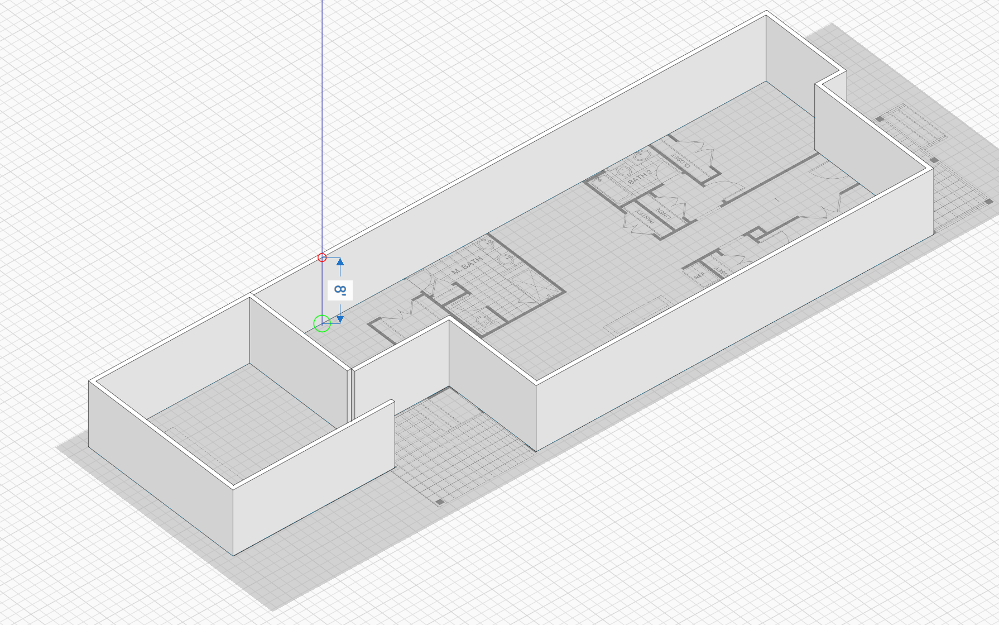

# Offset Line

Draw parallel, or offset, lines using the Offset Line tool. This is useful to create 2D shapes that can later be extruded to look like 3D walls.

The **Offset Line** tool works similar to the [**Line** ](https://windows.help.formit.autodesk.com/tool-library/line-tool)tool: 

* Click to set the first point and then move your cursor and place the subsequent points, snapping to existing geometry or to inference axes. 
* A preview of the resulting shape is shown. The second and third points determine the plane for the rest of the points to follow, so the result is planar.
* Continue adding points, and **Escape** or double click to finish the tool
* Any self-intersections will be cleaned up and merged, leaving you with one extrudable face.

The input line is drawn in red, and by default is placed in the center of the offset lines. 

You can change the alignment of the offset lines and their thickness by hitting the **Tab** key. This will invoke the **Tool Options** dialog:

Change the **Alignment** to **Left** and the **Thickness** to 6", for example, and the offset lines will be drawn to the left of the input lines, 6 inches apart.

## Useful Tips

You can draw a closed shape by snapping to the first point placed. The resulting corner will be cleaned up automatically:

You can freely draw the input lines on top of each other. When the tool is finished the resulting intersections are cleaned up.

Inherently, the Offset Line tool must generate geometry on a plane, so the first few points determine the plane that the remaining points will follow. 

Start drawing on the side of a cube, for example, to use the plane of that face. After three non colinear points are placed the input plane is fixed for the remainder of the input. Note, that when drawing on a face the resulting shape is inserted into the face, splitting it into multiple faces. To prevent the insertion, the face you draw on must be part of a [Group](https://windows.help.formit.autodesk.com/tool-library/groups).

You can also use the Offset Line tool to trace from a plan drawing. Import the plan as an image. 

* Resize the image so that the plan has the proper scale. This is described in more detail [here](https://windows.help.formit.autodesk.com/building-the-farnsworth-house/work-with-images-and-the-ground-plane). 
* You can use the [Orthographic Camera](orthographic-camera.md) to trace in an orthographic [top view](orthographic-views.md)

