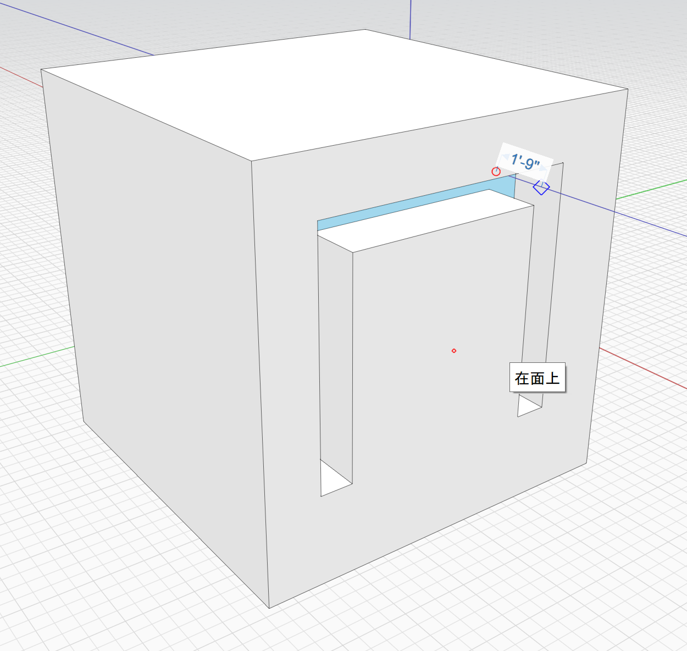

# Offset Line

You can use the Offset Line tool to draw parallel lines. This is useful to create 2d shapes that can later be extruded to look like 3d walls.

Keyboard: O L

The **Offset Line** tool works similar to the [**Line** ](https://windows.help.formit.autodesk.com/tool-library/line-tool)tool. Click the first point and then drag the second point, snapping to existing geometry or to inference axes. A preview of the resulting shape is shown. After the second point is placed the drawing continues and you now define the next shape. This continues until you hit the **Escape** key or double click.  

The input line is drawn in red, and by default is placed in the center of the offset lines. You may change the alignment of the offset lines and their thickness by hitting the **Tab** key. This will invoke the **Tool Options** dialog.

Change the **Alignment** to **Left** and the **Thickness** to 6", for example, and the offset lines will be drawn to the left of the input lines, 6 inches apart.

## Some useful hints when using the Offset Line tool

You may draw a closed shape by snapping to the first point placed. The resulting corner will be cleaned up automatically:

You may freely draw the input lines on top of each other. When the tool is finished the resulting intersections are cleaned up.

The nature of the tool requires that the offset lines are generated in a plane. You can use inferencing to lock your lines to a plane. Start drawing on the side of a cube, for example, to use the plane of that face. After three non colinear points are placed the input plane is fixed for the remainder of the input. Note, that when drawing on a face the resulting shape is inserted into the face, splitting it into multiple faces. To prevent the insertion, the face you draw on must be part of a group. See the [Groups ](https://windows.help.formit.autodesk.com/tool-library/groups)section for more information.

You can quickly recreate walls from a plan drawing. Import the plan as an image. Resize the image so that the plan has the proper scale. This is described in more detail [here](https://windows.help.formit.autodesk.com/building-the-farnsworth-house/work-with-images-and-the-ground-plane). Then trace the walls on top of the image. Finally extrude the resulting shapes.

