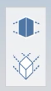
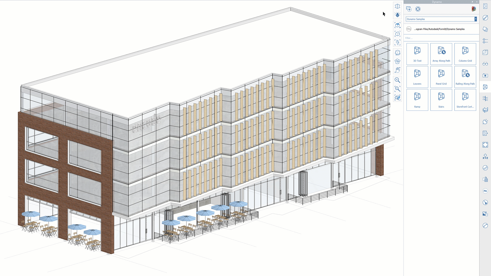
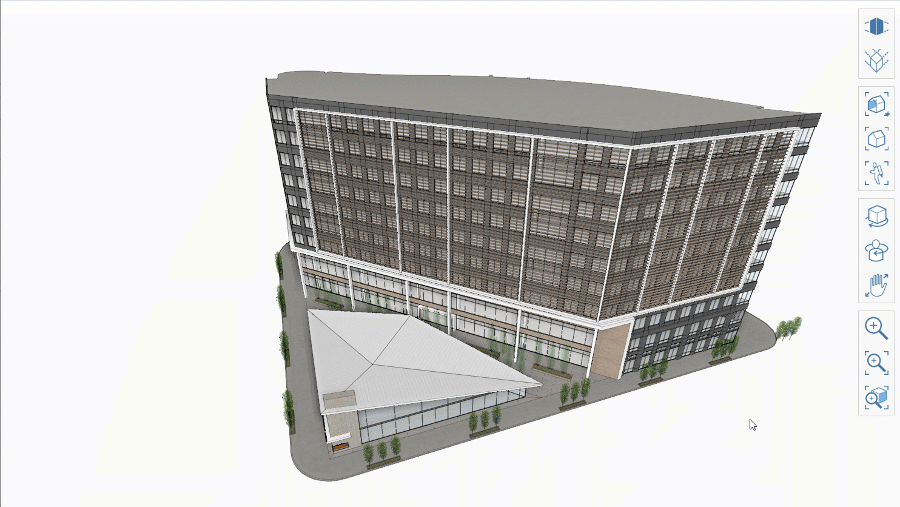

# Caméra orthographique 

FormIt 2021 inclut l’ajout d’une nouvelle fonction de caméra orthogonale. Les boutons Orthogonale et Perspective sont disponibles dans le menu de navigation :

Cette nouvelle option vous permet de basculer facilement entre les vues de caméra Orthogonale et Perspective.

Une fois dans la caméra orthogonale, tous les autres outils de caméra respectent le mode actif. Par exemple, l’option **Aligner caméra avec face** permet d’aligner la caméra orthogonale sur la face, ce qui génère une vue d’élévation orthogonale.

Si vous accédez manuellement à une vue orthogonale prédéfinie, telle que Vue de dessus ou Vue de face, la caméra orthogonale s’accroche à cette position, facilitant ainsi l’accès à ces vues prédéfinies.

**Remarque :** si la délimitation de la caméra se produit en mode Caméra orthogonale, vous pouvez revenir en mode Perspective, effectuer un zoom arrière, puis réessayer.

