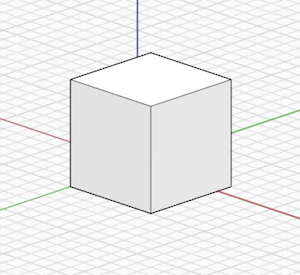
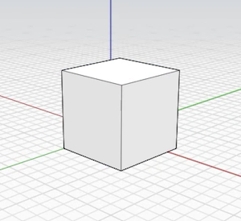

# Orthographic Camera

FormIt 2021 includes the addition of a new Orthographic Camera feature. You can find the Orthographic and Perspective buttons in the Floating Navigation Menu:

This new option allows you to easily toggle between the Orthographic and Perspective camera views:

