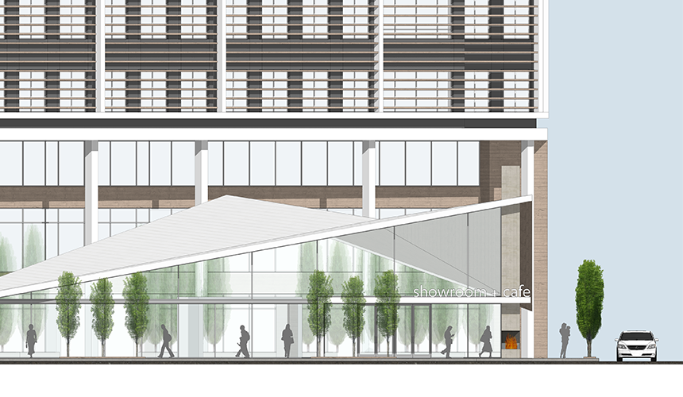
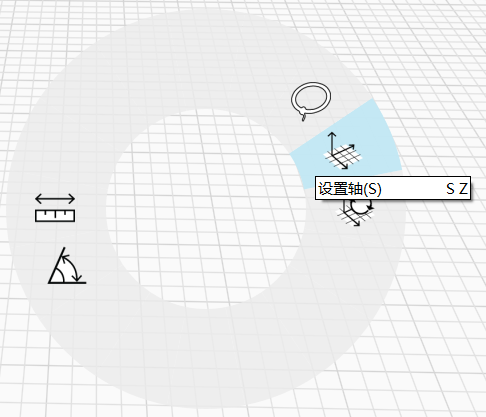
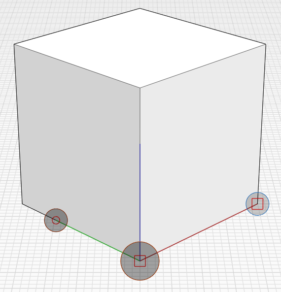

# Orthographic Views

**View your model in various orthographic views, including top, sides, and bottom.**

**You'll find orthographic views by clicking the top icon in the floating navigation toolbar:**

**Some helpful hints when working with orthographic views:**

* When switching between orthographic views, FormIt will maintain the zoom level for consistency.
* When switching elevation views \(front/right/left/back\), FormIt will maintain the ground height for consistency.
* You can hold Shift while Panning in an orthographic view to lock the Pan movement to the horizontal or vertical axis.
* Orthographic view directions are based on the world axes. You can realign the axes, which will change the orientations of all the orthographic views:
  * Use shortcut SZ, or right-click in space \(not over any geometry\):
  *  
  * Set the origin, and set the grip on the red axes to align it with a meaningful direction
  *  

**Orthographic views work in conjunction with other FormIt features:**

* Save elevation views as Scenes so you can return to them later.
* Control visibility of geometry that might get in the way of elevation views using Layers.
* Add Section Planes to create section-elevations.

