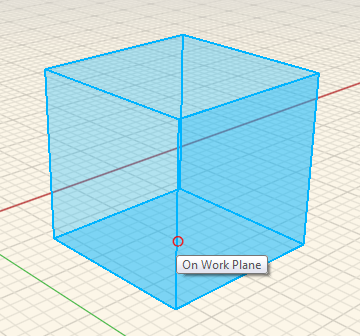

# Placing Primitives

1. In the [Action Toolbar](https://github.com/FormIt3D/autodesk-formit-360-windows-help/tree/c377e7b8a3b8e43e684321d0b7de867608d317a3/tool-library/tool-bars-extended.md) click to open **Primitives button** and [select](select-edge-face-or-object.md) the cube.   
2. Then drag and **click to place** the cube.   

