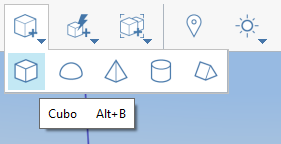

# 放置基本圖元

1. 在[動作工具列](https://github.com/FormIt3D/autodesk-formit-360-windows-help/tree/c377e7b8a3b8e43e684321d0b7de867608d317a3/tool-library/tool-bars-extended.md)中，按一下以開啟**「基本圖元」按鈕**並[選取](select-edge-face-or-object.md)立方體。
2. 然後拖曳並**按一下以放置**立方體。
3. 拖曳立方體時，會以預設尺寸顯示。**拖曳時**可以按 **Tab** 鍵變更這些尺寸。這會顯示**「工具選項」**對話方塊，您可在其中編輯尺寸。
4. 輸入新值並按**「確定」**後，立方體將顯示新的尺寸。

