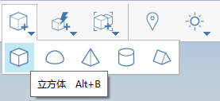

# Umieszczanie prymitywów

1. Na [pasku narzędzi operacji](https://github.com/FormIt3D/autodesk-formit-360-windows-help/tree/c377e7b8a3b8e43e684321d0b7de867608d317a3/tool-library/tool-bars-extended.md) otwórz kliknięciem **przycisk Prymitywy** i [wybierz](select-edge-face-or-object.md) sześcian. 
2. Następnie przeciągnij i **kliknij, aby umieścić** ten sześcian. 
3. Podczas przeciągania sześcianu będzie on wyświetlany z domyślnymi wymiarami. Te wymiary można zmienić **podczas przeciągania**, naciskając klawisz **Tab**. Spowoduje to wyświetlenie okna dialogowego **Opcje narzędzia**, w którym można edytować wymiary. 
4. Po wprowadzeniu nowych wartości i naciśnięciu przycisku **OK** sześcian zostanie wyświetlony z nowymi wymiarami.

