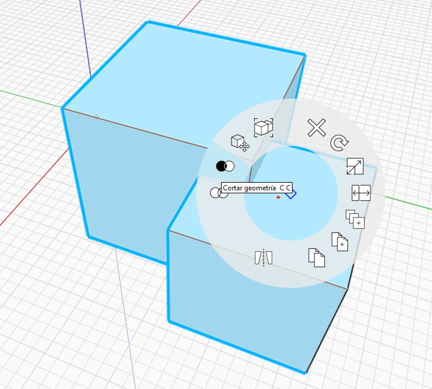
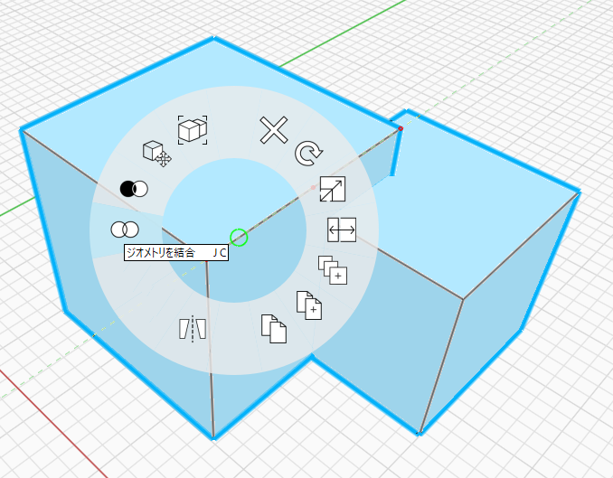

### Boolean Cut and Join
---

1. Double click to select one of the cubes you have created.

2. Move one cube so that it overlaps the other.

3. Select both cubes. You can do this by either:
    - Holding the **CTRL key** down while **double clicking.**
    - Using a standard crossing window by **left click** and **dragging** in the scene.
    - Right click in the scene and choosing the **Lasso tool** for a more fine-grained selection.

4. To **Cut**, right click on the object that will be cut, and choose the [**Cut tool**](/tool-library/boolean-operations.md) in the Context Menu.

5. To **Join**, right click on either object and choose
the [**Join tool**](/tool-library/boolean-operations.md) in the Context Menu. 

