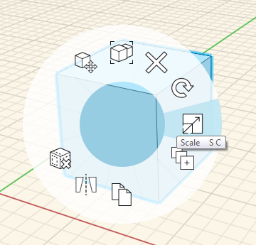
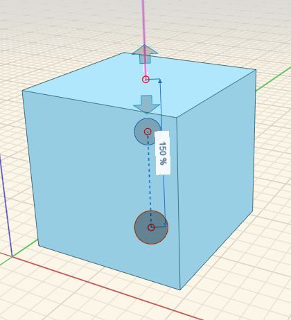

### Scale
---
> Adjust the size and orientation of objects.

---

#### Scale
First select, right-click to access the Context Menu. Then choose the scale icon. Use the scroll wheel on your mouse to scale the geometry up or down.

