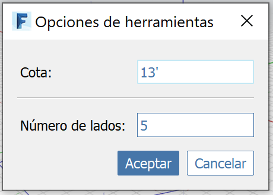

# Polygone

Utilisez l’outil Polygone pour dessiner un polygone régulier à n côtés dans l’espace ou sur un autre objet.

Démarrez le polygone et cliquez pour choisir le point central. Pour spécifier le rayon, dessinez le second point, tapez une cote ou appuyez sur la touche **Tab** pour afficher les **options d’outil**.

La boîte de dialogue **Options d’outil** vous permet de changer le nombre de côtés et de spécifier un rayon particulier.

