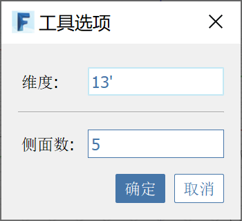

# Poligono

Utilizzare lo strumento Poligono per disegnare un poligono a n lati regolare nello spazio o su un altro oggetto.

Avviare il poligono e fare clic per scegliere il punto centrale. Specificare il raggio disegnando il secondo punto, digitando una quota o premendo **TAB** per visualizzare **Opzioni strumento**.

**Opzioni strumento** permette di cambiare il numero di lati e specificare un determinato raggio.

