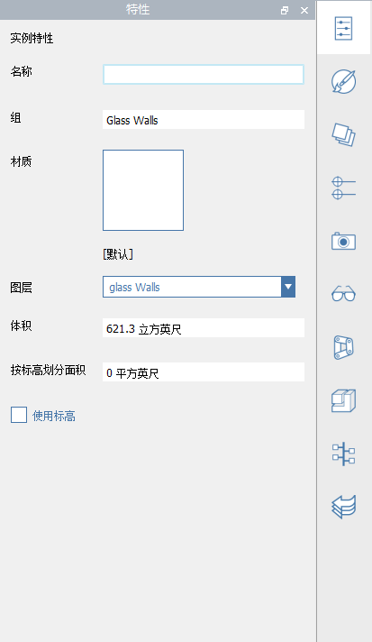

# Vlastnosti

**Paleta Vlastnosti** zobrazuje informace a data týkající se vybraného objektu v pracovní rovině aplikace FormIt.

Pomocí palety Vlastnosti můžete upravit skupinu objektu, přiřadit objekt k hladině a změnit materiál objektu.

