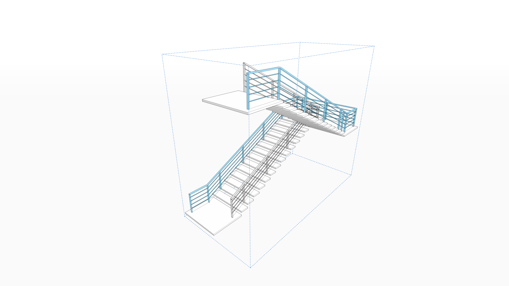

# Railing Along Path

## Powered By Dynamo

In FormIt 2021 and newer, you can generate a railing along a path, and quickly customize the results in-place. Railing Along Path is powered by Dynamo, which means the resulting railing is easily configurable to get the results you want, and re-running the logic will update the geometry in-place.

## Starting Railing Along Path

* Go to the Dynamo panel in FormIt for Windows, and ensure you're in the Dynamo Samples directory
* Click the Railing Along Path sample
* On the left side of the screen, you'll see a prompt to "Select path for railing"
  * You should select only a series of contiguous edges, or a Group containing only a series of edges.
  * Once you've got the path selected, click the "finish" button, or hit Enter/Return.
* The Dynamo panel will indicate it's processing the changes. When it's done, you'll have a Dynamo-generated railing in a FormIt Group, ready for modifying \(see below\).

