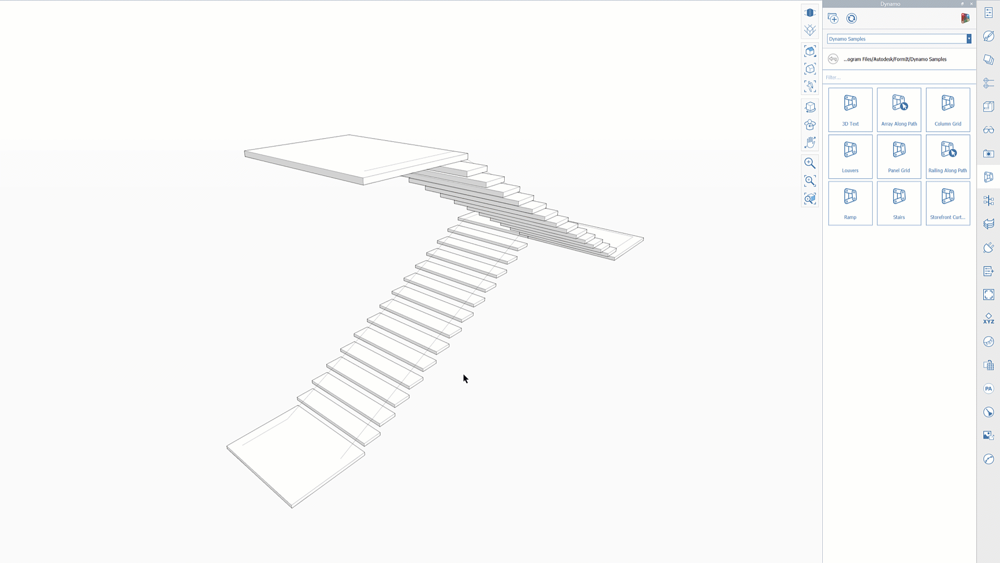
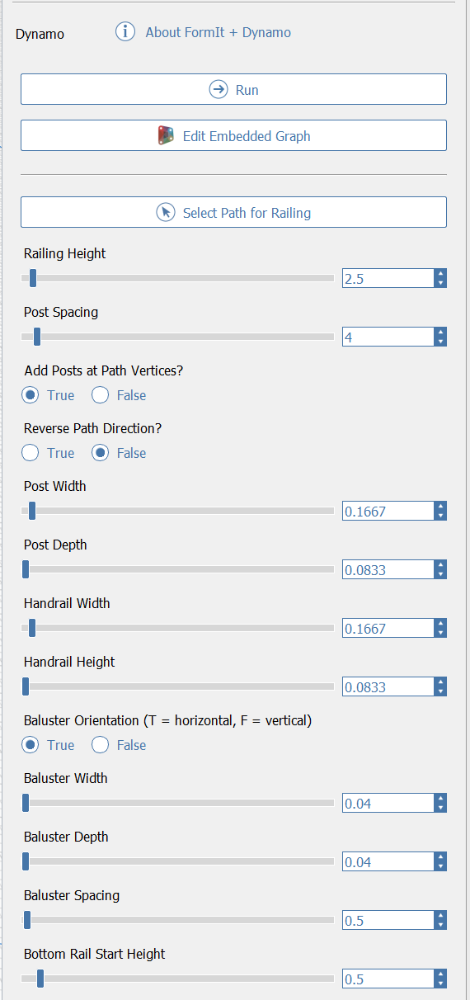

# Skript Railing Along Path

## Používá technologii aplikace Dynamo

V aplikaci FormIt 2021 a novějších verzích můžete vygenerovat zábradlí podél trajektorie a rychle přizpůsobovat výsledky na místě. Skript Railing Along Path používá technologii aplikace Dynamo, což znamená, že výsledné zábradlí lze snadno konfigurovat tak, abyste dosáhli požadovaných výsledků, a novým spuštěním logiky dojde k aktualizaci geometrie na místě.

## Spuštění skriptu Railing Along Path

* V aplikaci FormIt pro systém Windows přejděte na panel aplikace Dynamo a ujistěte se, že se nacházíte v adresáři Dynamo Samples.
* Klikněte na ukázku Railing Along Path.
* Na levé straně obrazovky se zobrazí výzva k výběru trajektorie pro zábradlí.
   * Měli byste vybrat pouze řadu přilehlých hran nebo skupinu obsahující pouze řadu přilehlých hran.
   * Po výběru trajektorie klikněte na tlačítko „Dokončit“ nebo stiskněte klávesu Enter/Return.
* Na panelu Dynamo se zobrazí zpráva o zpracování změn. Po dokončení této operace budete mít ve skupině aplikace FormIt zábradlí vytvořené aplikací Dynamo, které bude připraveno k úpravám \(viz níže\).

## Iterace na místě

Po spuštění skriptu Railing Along Path uvidíte, že jeho výsledky jsou nastaveny na výchozí hodnoty. Možná vám vyhovují, ale zábradlí si můžete výrazně přizpůsobit svým potřebám.

Při spuštění skriptu Railing Along Path se vytvoří nová skupina obsahující výsledky a aplikace FormIt automaticky vybere skupinu a zobrazí dostupné možnosti pro danou instanci skriptu Railing Along Path.

K vlastnostem skriptu Railing Along Path se můžete kdykoli vrátit výběrem skupiny a přepnutím na panel vlastností nebo úpravou skupiny, která automaticky zobrazí vlastnosti.

### Railing Height

Celková výška zábradlí. Použijí se aktuální jednotky aplikace FormIt.

### Post Spacing

Rozteč mezi hlavními vertikálními sloupky. Použijí se aktuální jednotky aplikace FormIt.

### Add Posts at Path Vertices

Pokud je nastavena hodnota **True**, budou sloupky přidány v každé vrcholu vybrané trajektorie a výpočet pro umístění dalšího sloupku se v tomto bodě obnoví.

Jestliže jste například vybrali řadu 3 hran, bude se sloupek zobrazovat v každém ze dvou vnitřních bodů. To je užitečné, pokud vrcholy označují změnu směru \(například chůze do schodů nebo zatáčka\), kde by se přirozeně vyskytoval sloupek.

Pokud je nastavena hodnota **False**, sloupky se přidají pouze podél trajektorie počínaje od jednoho konce a budou měřit vzdálenost podél trajektorie, přičemž budou ignorovat vrcholy podél trajektorie. To je užitečné, pokud jste vybrali oblouk, spline nebo kružnici, kde vrcholy nejsou důležité a chcete, aby je rozteč sloupků ignorovala.

### Reverse Path Direction

Při výpočtu umístění sloupků bude směr vybrané trajektorie určovat, na kterém konci trajektorie začne měření rozteče sloupků.

V případech, kdy rozteč sloupků vytváří zbývající prostor na nežádoucím konci trajektorie, můžete tuto hodnotu změnit na hodnotu **True**, čímž se křivka převrátí a měření rozteče sloupků začne na opačném konci.

### Post Width + Depth

Velikost \(v půdorysu\) obdélníkových svislých profilů sloupků. Použijí se aktuální jednotky aplikace FormIt.

### Handrail Width + Height

Velikost \(v řezu\) obdélníkového profilu madla zábradlí. Použijí se aktuální jednotky aplikace FormIt.

### Baluster Orientation

Pokud je hodnota True, příčle budou orientovány horizontálně, podobně jako kabely. Pokud je hodnota False, příčle budou orientovány vertikálně, aby bylo dosaženo tradičnějšího estetického dojmu.

### Baluster Width + Depth

Velikost obdélníkového profilu příčle. Použijí se aktuální jednotky aplikace FormIt.

### Baluster Spacing

Velikost mezery mezi jednotlivými příčlemi. Použijí se aktuální jednotky aplikace FormIt.

### Bottom Rail Start Height

Vzdálenost mezi dolní částí zábradlí a dolní lištou, která podpírá příčle. Použijí se aktuální jednotky aplikace FormIt.

### Run

Po úpravě možností kliknutím na tlačítko Run spusťte základní graf aplikace Dynamo a vygenerujte nové výsledky. Toto tlačítko se po změně parametrů zbarví modře, abyste věděli, že je třeba na tlačítko kliknout, aby se aktualizace zobrazily ve výsledné geometrii.‌

### Edit Embedded Graph

Kliknutím na toto tlačítko spustíte prostředí editoru grafu aplikace Dynamo, ve kterém můžete prohlížet a upravovat základní graf Dynamo a rychle měnit parametry a zobrazovat živé aktualizace nebo kontrolovat či upravovat logiku.

