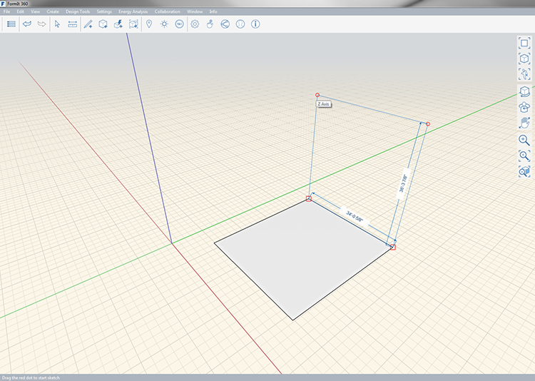

# Rectangle

You can use the **Rectangle** tool in the **Create Sketch** toolbar menu to quickly draw a rectangular face. Extrude the face to create a rectangular volume.

Keyboard shortcut: R

Use the axes to ensure you're drawing in the correct direction:

You can draw rectangles on the X, Y, or Z axis. As you draw, you can specify a dimension by simply typing in a value, which will bring up the Edit Dimension dialog. Hit Enter or press OK to accept the dimension.

Line colors by axis:

* X = Red
* Y = Green
* Z = Blue

When you finish drawing the rectangle, it becomes a face that can be extruded to create a volume.

