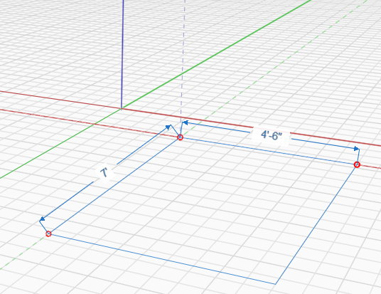

# Rettangolo

È possibile utilizzare lo strumento **Rettangolo** nel menu della barra degli strumenti **Crea disegno** per disegnare rapidamente una superficie rettangolare. Estrudere la superficie per creare un volume rettangolare.

Tasto di scelta rapida: R

Utilizzare gli assi per assicurarsi di disegnare nella direzione corretta:

È possibile disegnare rettangoli sull'asse X, Y o Z. Mentre si disegna, è possibile specificare una quota digitando semplicemente un valore, che consentirà di visualizzare la finestra di dialogo Modifica quota. Premere INVIO o OK per accettare la quota.

Per disegnare un rettangolo, fare clic per impostare il primo punto nel disegno.

Colori delle linee per asse:

* X = Rosso
* Y = Verde
* Z = Blu

Una volta completato il disegno, il rettangolo diventa una superficie che può essere estrusa per creare un volume.

