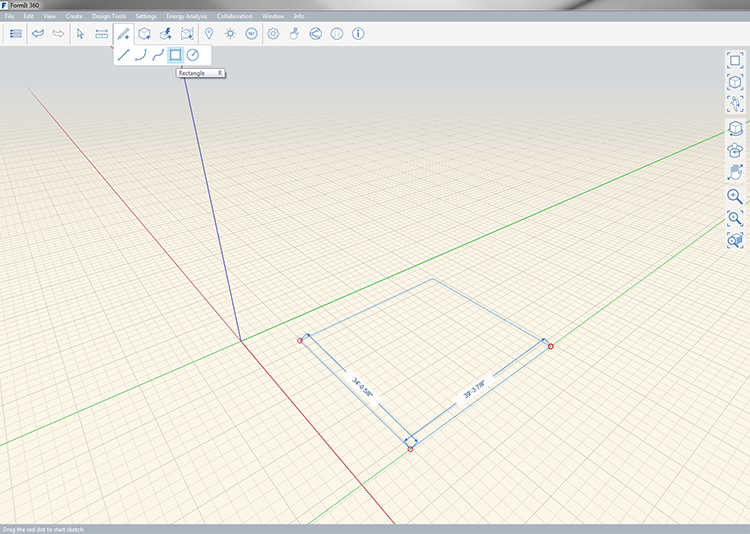
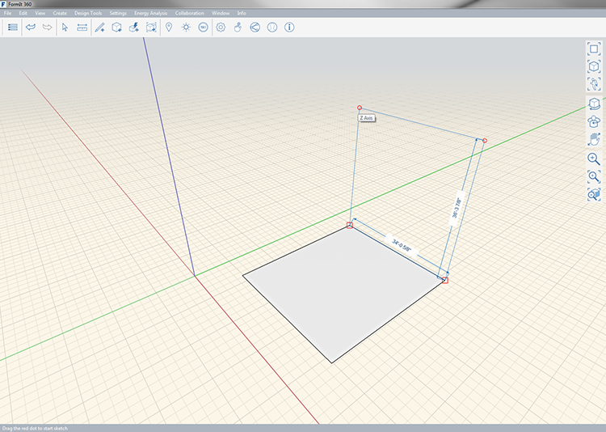

### Rectangle Tool

---
> Draws a rectangle that becomes a face when opteration is complete. The resulting face can be extruded into a volume. 

---

A rectangle can be draw on all the X, Y and Z axis. When you're snapped to an axis a colored line will extend beyond one edge of the rectangle as you are drawing. You can see the length of one side of the rectangle as you draw; to manually a specify a length press **tab** and enter that length.

- X = Red
- y = Green
- Z = Blue

You can see the length of the line as you draw; to manually specify a length press **tab**. 

Once you are finished drawing the rectangle it will become a face that can be extruded to create a volume. 