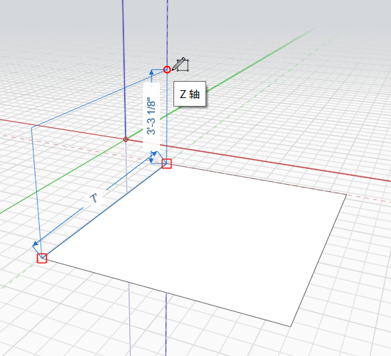

# Retângulo

É possível usar a ferramenta **Retângulo** no menu da barra de ferramentas **Criar esboço** para desenhar rapidamente uma face retangular. Faça a extrusão da face para criar um volume retangular.

Atalho de teclado: R

Use os eixos para assegurar que você esteja desenhando na direção correta:

É possível desenhar retângulos no eixo X, Y ou Z. Ao desenhar, é possível especificar uma cota simplesmente digitando um valor, que abrirá a caixa de diálogo Editar cota. Pressione Enter ou OK para aceitar a cota.

Para desenhar um retângulo, clique para definir o primeiro ponto no esboço.

Cores de linha por eixo:

* X = Vermelho
* Y = Verde
* Z = Azul

Quando você terminar de desenhar o retângulo, ele se torna numa face que pode sofrer extrusão para criar um volume.

