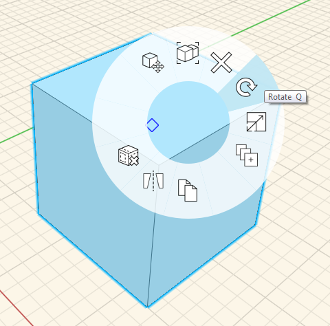

# Rotate Object

You can change the orientation of objects using the Rotate tool in the Context Menu.

1. Select an element you want to rotate and right-click to launch the Context Menu.
2. From the Context Menu, select the Rotate tool. 
3. When the protractor graphic appears on your mouse, click to set the plane for rotation.
4. Use the blue grips to specify the start point of the rotation, and reset the axis if necessary. Use the arrows or the editable dimension box to set the rotation angle. 

Note that you can alse use the **Q** keyboard shortcut to access the rotate tool after selecting an element.

  

