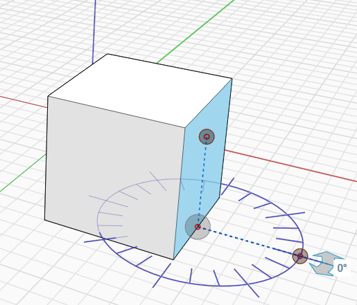

# Obracanie obiektu

Orientację obiektów można zmieniać za pomocą narzędzia Obróć z menu kontekstowego.

1. Wybierz element, który chcesz obrócić, i kliknij prawym przyciskiem myszy, aby wyświetlić menu kontekstowe.
2. Z menu kontekstowego wybierz narzędzie Obróć.
3. Gdy na wskaźniku myszy pojawi się grafika kątomierza, kliknij, aby ustawić płaszczyznę obrotu.
4. Użyj niebieskich uchwytów, aby określić punkt początkowy obrotu i jeśli to konieczne, zresetuj oś. Za pomocą strzałek lub edytowalnego pola wymiarowego ustaw kąt obrotu.

Można też użyć skrótu klawiaturowego **Q**, aby po wybraniu elementu uzyskać dostęp do narzędzia obrotu.

  

