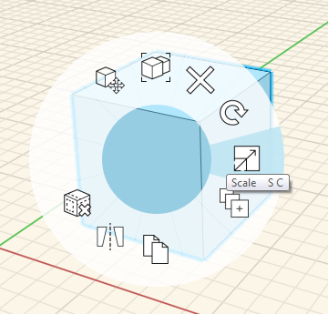

# Scale Object

You can use the **Scale tool** to adjust the size and orientation of objects.

1. Select an object you want to adjust. 
2. Right-click to launch the **Context Menu**. 
3. From the Context Menu, select the **Scale tool**. 
4. Use the scroll wheel on your mouse to scale the geometry up or down.

