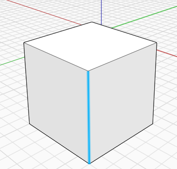
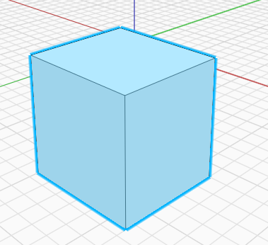
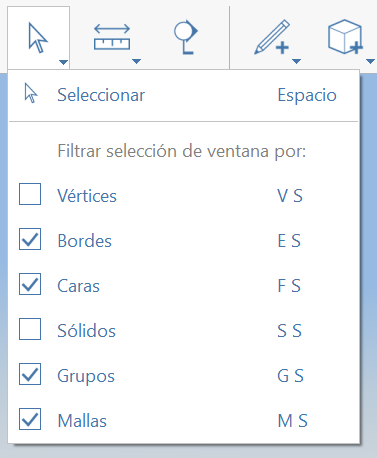
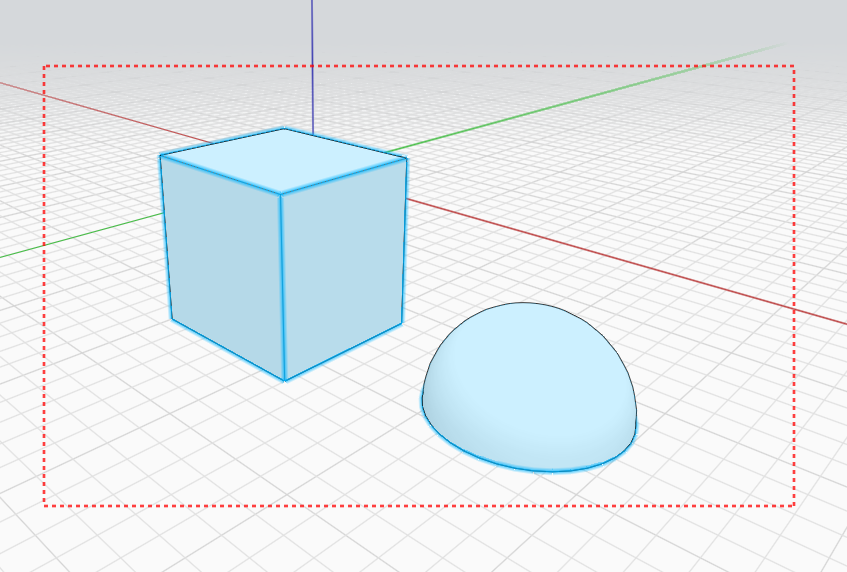
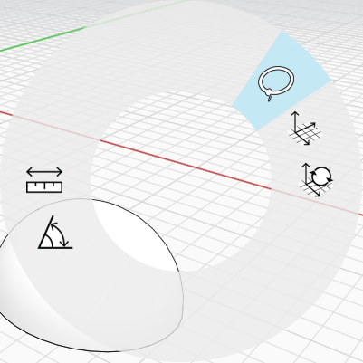
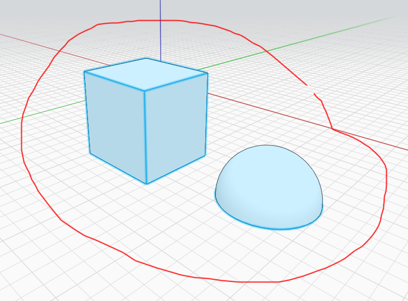

# Selección

## Selección directa

Para **seleccionar un vértice, un borde o una cara**, coloque el cursor sobre el objeto y, a continuación, haga clic una vez para seleccionarlo.

Para **seleccionar un objeto completo** o un objeto y cualquier elemento enlazado a él, haga doble clic en el objeto.

También puede mantener pulsada la tecla Ctrl o Mayús y añadir o eliminar elementos de la selección actual.

## Filtrado de la selección

Para la selección de área o de forma irregular \(vea la imagen mostrada continuación\), puede filtrar la selección en función del tipo.

Esto resulta muy útil cuando hay diferentes tipos de geometría muy cerca y desea usar la selección de área o de forma irregular para realizar una selección amplia que recupere un determinado tipo de geometría, sin incluir los demás.

## Selección de área/ventana

Para **seleccionar varias partes de la geometría simultáneamente**, utilice la herramienta de selección de ventana. Asegúrese de que no haya nada seleccionado y, a continuación, haga clic y arrastre el ratón de izquierda a derecha o de derecha a izquierda para capturar varias piezas.

## Selección de forma irregular

Para obtener un **control más preciso** al seleccionar simultáneamente varias piezas de geometría, utilice la herramienta Selección de forma irregular. Puede seleccionarla en el menú contextual después de hacer clic con el botón derecho en el lienzo vacío. A continuación, dibuje un contorno alrededor del área de selección deseada.

  

