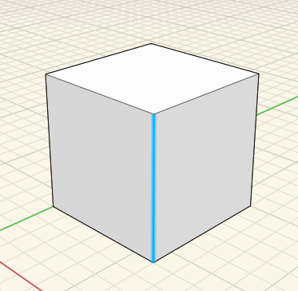
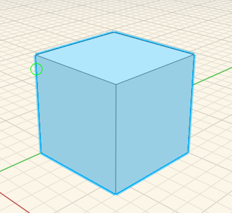
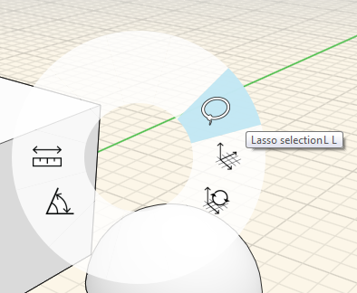
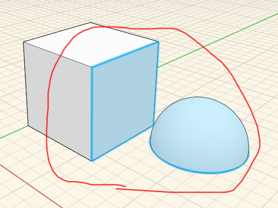
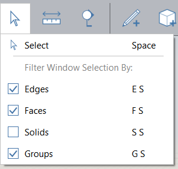

# Selection

## Select Edge, Face, or Object

Choosing an object or surface is the first step to making modifications to that object

To **select a face, edge or vertex**, hover over them - then single click to select.

To **select an entire object**, double click the object.

To **select multiple pieces of geometry simultaneously**, use the window selection tool. Make sure you have nothing selected, then you can click and drag your mouse from left to right, or from right to left, to capture multiple pieces.

## Lasso

For **more precise control** in selecting multiple pieces of geometry simultaneously, use the lasso tool. You can select it from the context menu after right-clicking over the empty canvas. Then draw a line around your desired selection area.

  

## Selection Filter

The window selection and lasso tools can be filtered to only select edges, faces, solids, groups or any combination of the four options

