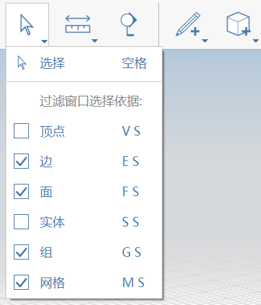

# Selezione

## Selezione diretta

Per **selezionare un vertice, un bordo o una superficie**, posizionare il cursore del mouse sull'oggetto, quindi fare un singolo clic per selezionarlo.

Per **selezionare un intero oggetto** o un oggetto e qualsiasi oggetto ad esso associato, fare doppio clic sull'oggetto.

È inoltre possibile tenere premuto CTRL o MAIUSC e aggiungere o rimuovere elementi dalla selezione corrente.

## Filtro di selezione

Per la selezione dell'area o con lazo \(vedere di seguito\), è possibile filtrare la selezione in base al tipo.

Ciò è particolarmente utile quando si dispone di una combinazione di tipi di geometria molto vicini e si desidera utilizzare la selezione dell'area o con lazo per proiettare una rete ampia, ma recuperare solo un determinato tipo di geometria, escludendone altri.

## Selezione dell'area/mediante finestra

Per **selezionare più parti di geometria contemporaneamente**, utilizzare lo strumento di selezione mediante finestra. Assicurarsi di non avere selezionato alcun elemento, quindi fare clic e trascinare il mouse da sinistra a destra o da destra a sinistra per acquisire più parti.

## Selezione con lazo

Per un **controllo più preciso** quando si selezionano più parti di geometria contemporaneamente, utilizzare lo strumento Selezione con lazo. È possibile selezionarlo dal menu contestuale dopo aver fatto clic con il pulsante destro del mouse sull'area di disegno vuota. Quindi disegnare un contorno attorno all'area di selezione desiderata.

  

