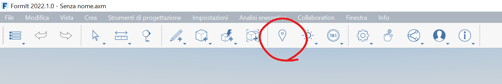
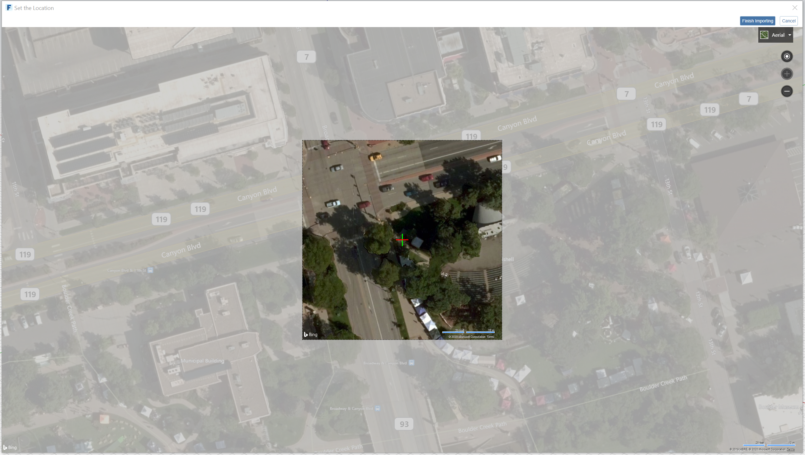
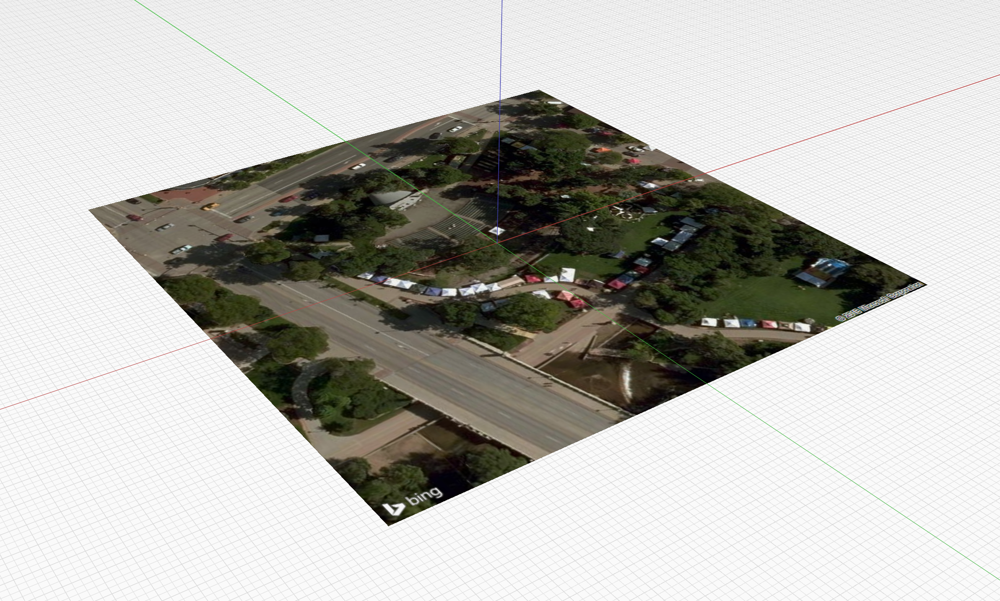
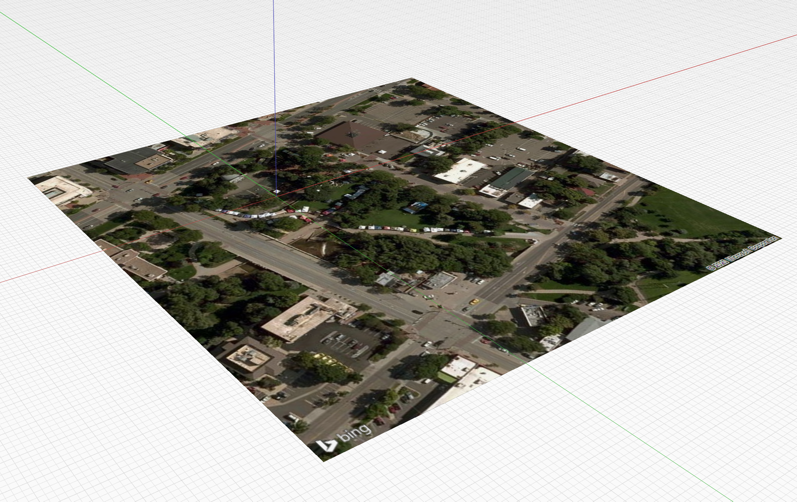
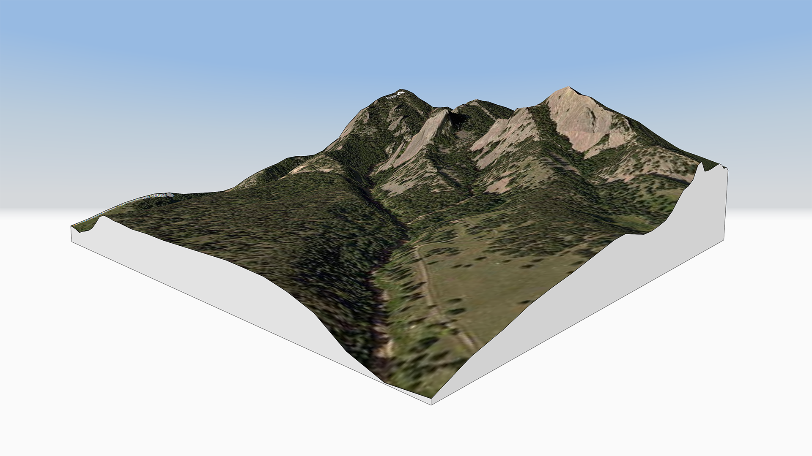
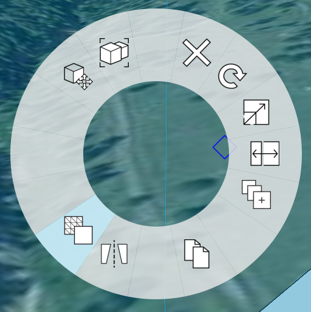
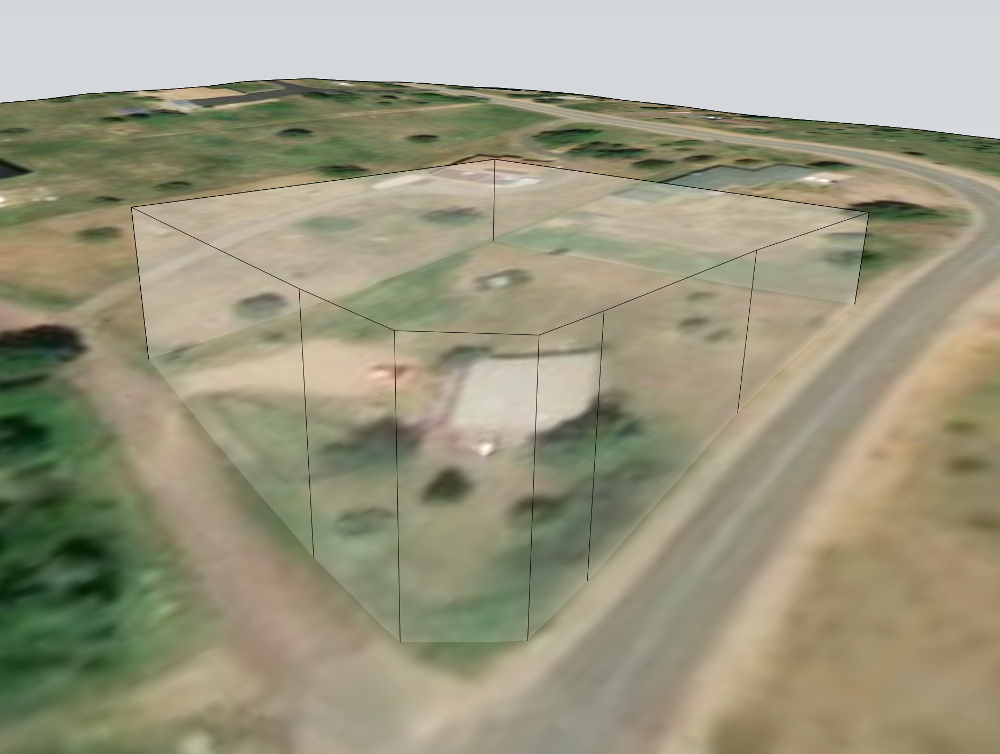
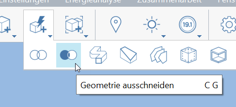
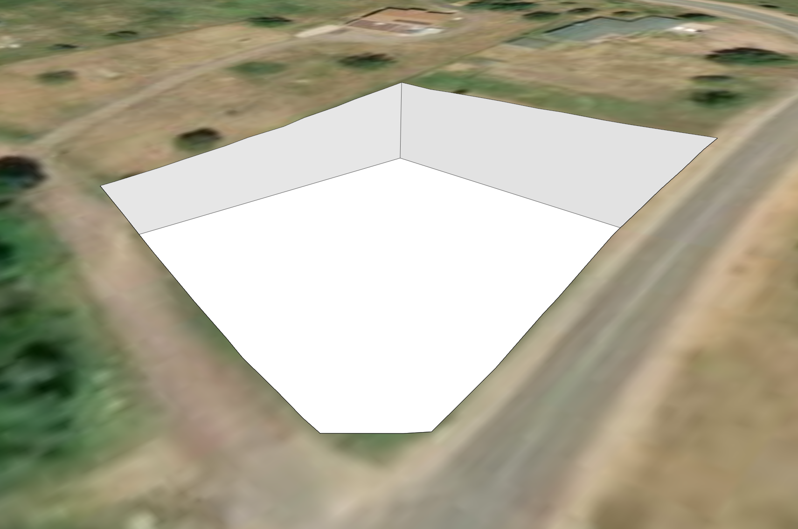

# Setting Location

Setting your your project's location in the world it is important for the accuracy of your model and downstream analyses, including:

* Location is used to import a satellite image which can be used to trace an existing site or building.
* Location is used to import 3D terrain, which can be used to reference topological data for a site.
* Location is used for accurate positioning of the sun in the sky, affecting the calculation of shadows.
* Location is used for Solar Analysis and Energy Analysis to provide accurate analytical calculations.

You'll need to be signed in with your Autodesk account to access the Set Location dialog and its services.

## Getting Started With Location

* Launch the **Set Location** dialog from the **Location** tool in the toolbar, or with the keyboard shortcut SL.

* Begin by typing the location of your project into the search box in the upper left hand corner of the _Set Location_ window. 

* Select one of the auto-populating location options, or hit Enter to choose the first one
* You'll zoom in to the location you searched for automatically

## Set Location Only vs. Import Satellite Image and Terrain

Once you've searched for a location, you can choose one of two options:

* **Set Location Only** will set the location in the file without importing satellite imagery.
* **Import Satellite Image and Terrain** will set the location, and will also import satellite imagery and terrain using a zoom level and extents you can configure.

## Importing Satellite Imagery

* Click **Import Satellite Image and Terrain** at the top right of the **Set Location** window.
* A preview of the satellite imagery will appear in the center of the window, along with an indication of where the FormIt origin will appear, relative to the imagery.

* Drag the satellite imagery within the square to adjust its position
* Once the square area encapsulates the imagery you want, click **Finish Importing**
* The image will be imported to scale, with true north facing up, centered at the FormIt canvas origin. You can change the transparency and Z-ordering of the imported image by double-clicking it and going to the [**Properties Palette**](../formit-introduction/tool-bars.md). 

## Updating Satellite Imagery

After importing satellite imagery the first time, you can use the Set Location window to adjust the zoom level or extents of the satellite imagery.

* Start the **Set Location** window again by accessing it from the toolbar, as outlined above.
* Click **Import Satellite Image and Terrain.**
* You'll see the current satellite image zoom level and extents, as shown in the FormIt canvas
* Simply adjust the position or zoom, and click **Finish Importing** as you did before
* When the image is re-imported into the canvas, it will move to the correct location relative to the original image position \(and may no longer be centered at the origin\):

## Importing Terrain

New in FormIt 2021.3, when you use the **Set Location** dialog to import satellite imagery, you'll also get terrain.

When terrain is imported, it's placed on a layer, which is off by default \(in case you've started modeling, your model may be covered by the terrain\).

When you're ready to view terrain, toggle the Terrain layer by checking the box:

## Working with Terrain

Terrain will be placed in a FormIt Group. Double-click the Group to edit it.

Inside, you'll find two Meshes: One for the sides and bottom, and one for the top.

If you want to modify the terrain, you'll need to convert the Meshes to a single, solid object:

* Select both Meshes
* Right click, and choose the Meshes to Objects option, or use shortcut MO

When converting both Meshes to an object at the same time, FormIt can combine them into a solid, manifold object, which can be used for solid operations like Boolean Cut.

From here, you can use a combination of [Top View](orthographic-views.md) and [Orthographic Camera](orthographic-camera.md) to trace your site boundary on a horizontal plane, then extrude that plane into a volume that intersects the terrain. Using a transparent [material](materials.md) helps so you can see the terrain through your cutting solid:

Use the Cut Geometry tool, and select the terrain as the "Solid to be cut into" and the cutting volume as the "Solid to be removed."

The result will be the terrain with your cutting solid removed, exposing void where you can draw your new site and foundation.

You can use [layers](layers.md) to hide the cutting solid, or even make copies of the terrain with and without the cut, in case you need to reference the original terrain, or change the cut shape before executing the solid cut operation.

