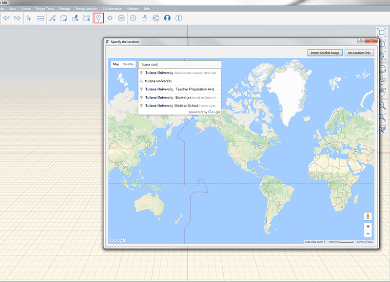
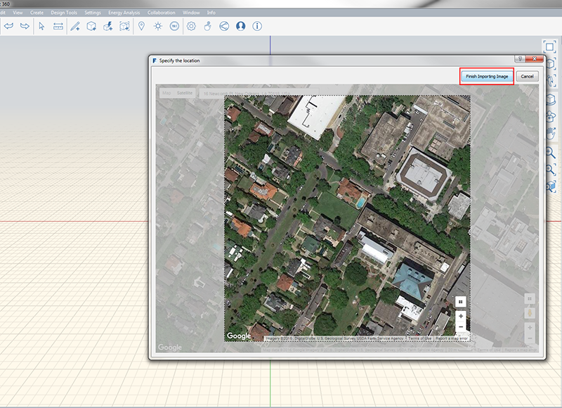

### Setting Location
---
> Setting your your project's location in the world it is important for the accuracy of the down-stream analyses. It also allows you to import a scaled satellite image to use as a backgroud reference.

---
The first step in setting a location is to make sure you are signed into your A360 account. Once you are signed in you will be able to access the location (LS) feature.

- Begin by typing the location of your project into the search box in the upper left hand corner of the *Specify Location* window. 

- Once you have located the position of your project site and the extends your want to import click the **Finish Importing Image**

- The image will then be imported to scale with true north facing up. You can change the appreance of the imported image by double clicking and going to the [**Properties Palette**](../formit-introduction/tool-bars.md). 
