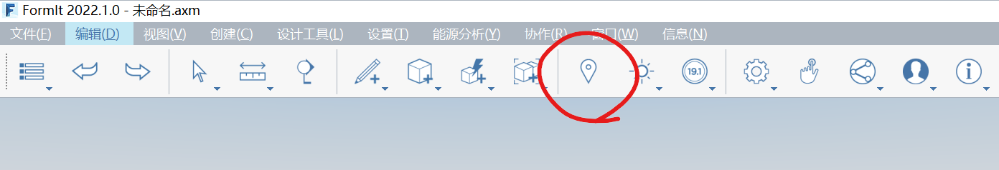

# Configuración de la ubicación

La configuración de la ubicación del proyecto en el mundo es importante para la precisión del modelo y los análisis posteriores, incluido lo siguiente:

* La ubicación se utiliza para importar una imagen de satélite que se puede utilizar para trazar un emplazamiento o edificio existentes.
* La ubicación se utiliza para importar terreno 3D, que se puede utilizar para hacer referencia a datos topológicos de un emplazamiento.
* La ubicación se utiliza para colocar con precisión el sol en el cielo, lo que afecta al cálculo de sombras.
* La ubicación se utiliza para el análisis solar y el análisis energético a fin de proporcionar cálculos analíticos precisos.

Deberá iniciar sesión con su cuenta de Autodesk Account para acceder al cuadro de diálogo Establecer ubicación y sus servicios.

### Para empezar a configurar la ubicación

* Inicie el cuadro de diálogo **Establecer ubicación** desde la herramienta **Ubicación** de la barra de herramientas o con el acceso directo del teclado SL.

* Escriba primero la ubicación del proyecto en el cuadro de búsqueda de la esquina superior izquierda de la ventana _Establecer ubicación_.

* Seleccione una de las opciones de ubicación de relleno automático o pulse Intro para elegir la primera
* Se ampliará la vista de la ubicación que ha buscado automáticamente.

### Comparación de Establecer solo ubicación e Importar imagen de satélite y terreno

Una vez que haya buscado una ubicación, puede elegir una de estados opciones:

* La opción **Establecer solo ubicación** definirá la ubicación en el archivo sin importar imágenes de satélite.
* La opción **Importar imagen de satélite y terreno** definirá la ubicación, e importará también imágenes de satélite y terreno con un nivel de zoom y extensión que se pueden configurar.

### Importación de imágenes de satélite

* Haga clic en **Importar imagen de satélite y terreno** en la parte superior derecha de la ventana **Establecer ubicación**.
* Aparecerá una vista preliminar de las imágenes de satélite en el centro de la ventana, junto con una indicación de dónde aparecerá el origen de FormIt en relación con las imágenes.

* Arrastre las imágenes de satélite dentro del cuadrado para ajustar su posición.
* Una vez que el área cuadrada encapsule las imágenes que desea, haga clic en **Finalizar importación de imagen**.
* La imagen se importará a escala, con el norte real orientado hacia arriba, centrado en el origen del lienzo de FormIt. Puede cambiar la transparencia y el orden Z de la imagen importada. Para ello, haga doble clic en ella y vaya a la [**paleta Propiedades**](../formit-introduction/tool-bars.md).

### Actualización de imágenes de satélite

Después de importar imágenes de satélite por primera vez, puede utilizar la ventana Establecer ubicación para ajustar el nivel de zoom o la extensión de las imágenes de satélite.

* Inicie de nuevo la ventana **Establecer ubicación** accediendo a ella desde la barra de herramientas, como se ha indicado anteriormente.
* Haga clic en **Importar imagen de satélite y terreno**
* Verá el nivel de zoom y la extensión de la imagen de satélite actual, como se muestra en el lienzo de FormIt.
* Solo tiene que ajustar la posición o el zoom y hacer clic en **Finalizar importación de imagen** como antes.
* Cuando la imagen se vuelva a importar en el lienzo, se desplazará a la ubicación correcta con respecto a la posición de la imagen original \(y puede que ya no esté centrada en el origen\), como se muestra a continuación:

### Importación de terreno

Como novedad en FormIt 2021.3, al utilizar el cuadro de diálogo **Establecer ubicación** para importar imágenes de satélite, también obtendrá terreno.

Cuando se importa terreno, este se coloca en una capa, que está desactivada por defecto \(en caso de que haya comenzado a modelar, el modelo puede estar cubierto por el terreno\).

Cuando esté listo para ver el terreno, active la casilla de verificación para activar o desactivar la capa de terreno, como se muestra a continuación:

### Trabajo con terreno

El terreno se colocará en un grupo de FormIt. Haga doble clic en el grupo para editarlo.

Dentro, encontrará dos mallas, una para los lados y la parte inferior y otra para la parte superior.

Si desea modificar el terreno, deberá convertir las mallas en un único objeto sólido, como se indica a continuación:

* Seleccionar ambas mallas.
* Haga clic con el botón derecho y elija la opción De mallas a objetos o utilice el método abreviado MO.

Al convertir ambas mallas en un objeto al mismo tiempo, FormIt puede combinarlas en un objeto sólido y múltiple, que se puede utilizar para operaciones sólidas como el corte booleano.

Desde aquí, puede utilizar una combinación de [Vista superior](orthographic-views.md) y [Cámara ortogonal](orthographic-camera.md) para trazar el contorno del emplazamiento en un plano horizontal y, a continuación, extruir el plano en un volumen que se interseque con el terreno. El uso de un [material](materials.md) transparente le ayuda a ver el terreno a través del sólido de corte, como se muestra a continuación:

Utilice la herramienta Cortar geometría y seleccione el terreno como el sólido en el que se cortará y el volumen de corte como el sólido que se va a eliminar.

El resultado será el terreno con el sólido de corte eliminado, lo que expone el vacío donde puede dibujar el nuevo emplazamiento y cimentación.

Puede utilizar [capas](layers.md) para ocultar el sólido de corte, o incluso para realizar copias del terreno con y sin el corte, en caso de que necesite hacer referencia al terreno original o cambiar la forma de corte antes de ejecutar la operación de corte de sólido.

