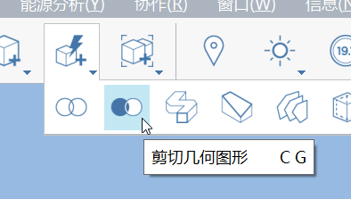

# 設定位置

設定專案在世界上的位置對於模型和下游分析的準確度非常重要，包括：

* 位置用於匯入衛星影像，該影像可用於追蹤既有的敷地或建築。
* 位置用於匯入 3D 地形，此地形可用於參考敷地的拓樸資料。
* 位置用於精確定位天空中的太陽，進而影響陰影的計算。
* 位置用於日光分析和能源分析，以提供精確的分析計算。

您必須使用您的 Autodesk 帳戶登入，才能存取「設定位置」對話方塊及其服務。

### 開始使用位置

* 從工具列中的**位置**工具，或使用鍵盤快速鍵 SL，啟動**「設定位置」**對話方塊。

* 首先，在_「設定位置」_視窗左上角的搜尋方塊中輸入專案的位置。

* 選取其中一個自動填入的位置選項，或按 Enter 選擇第一個選項
* 您將會自動拉近到您搜尋的位置

### 「僅設定位置」與「匯入衛星影像和地形」

搜尋到位置後，您可以選擇以下兩個選項之一：

* **「僅設定位置」**將在檔案中設定位置，而不匯入衛星影像。
* **「匯入衛星影像和地形」**將設定位置，並且使用您可以規劃的縮放層級和範圍匯入衛星影像和地形。

### 匯入衛星影像

* 按一下**「設定位置」**視窗右上角的**「匯入衛星影像和地形」**。
* 衛星影像的預覽會顯示在視窗中央，並指示 FormIt 原點相對於影像的顯示位置。

* 將衛星影像拖曳到方形中以調整其位置
* 當方形區域封裝所需影像後，按一下**「完成匯入」**
* 影像將匯入以調整比例，正北朝上，中心位於 FormIt 圖元區原點。您可以按兩下匯入的影像並移至[**性質選項板**](../formit-introduction/tool-bars.md)，來變更其透明度和 Z 順序。

### 更新衛星影像

首次匯入衛星影像後，您可以使用「設定位置」視窗來調整衛星影像的縮放層級或範圍。

* 從工具列存取**「設定位置」**視窗 \(如上所述\)，以再次啟動該視窗。
* 按一下**「匯入衛星影像和地形」。**
* 您將看到目前衛星影像的縮放層級和範圍，如 FormIt 圖元區所示
* 只需調整位置或縮放，然後按一下**「完成匯入」**，如之前所做
* 將影像重新匯入至圖元區時，影像會移至相對於原始影像位置的正確位置 \(可能不再置中於原點\)：

### 匯入地形

FormIt 2021.3 的新功能，當您使用**「設定位置」**對話方塊匯入衛星影像時，也會得到地形。

匯入地形後，它會放置在預設關閉的圖層上 \(如果您已開始塑型，模型可能會被地形覆蓋\)。

當您準備好檢視地形時，請勾選方塊以切換「地形」圖層：

### 使用地形

地形將放置在 FormIt 群組中。按兩下該群組，可進行編輯。

在當中，您會找到兩個網格：一個用於側邊和底部，一個用於頂部。

如果要修改地形，您必須將網格轉換為單一實體物件：

* 選取兩個網格
* 按一下右鍵，然後選擇「網格變物件」選項，或使用快速鍵 MO

同時將兩個網格轉換為物件時，FormIt 可以將它們合併為一個實體流形物件，此物件可用於進行實體作業 \(例如布林切割\)。

從這裡，您可以結合使用[上視圖](orthographic-views.md)和[正投影相機](orthographic-camera.md)，在水平平面上追蹤敷地邊界，然後將該平面擠出到與地形相交的體積。使用透明[材料](materials.md)有助於您透過切割實體查看地形：

使用「切割幾何圖形」工具，然後在「選取要被切割的實體」選取地形，在「要移除的實體」選取切割體積。

結果將是移除切割實體後的地形，您可以在顯示的空心當中繪製新敷地和基礎。

您可以使用[圖層](layers.md)隱藏切割實體，或甚至製作包含和不包含切割的地形複本，以免您在執行實體切割作業之前需要參考原始地形，或變更切割造型。

