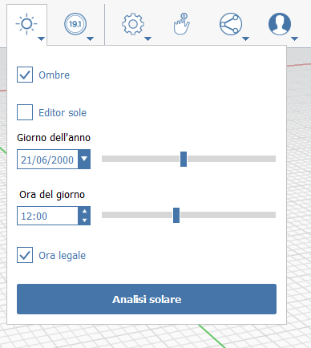
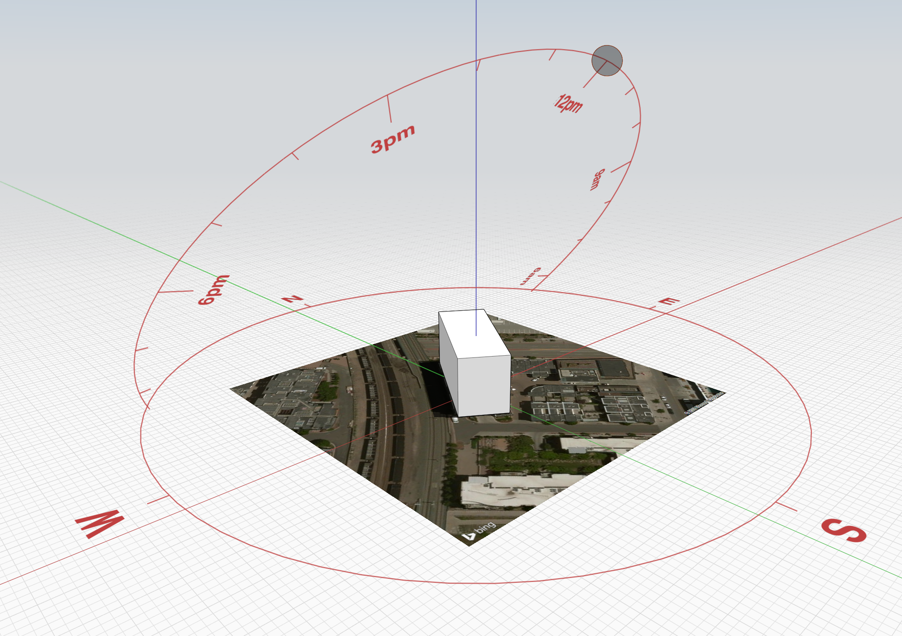

# Sun + Shadows

Use the **Sun + Shadows** tool to study the effects of the sun's path on your projects.

The first step for accurate shadow studies is to [**set your project location**](setting-location.md). 

Once you've set your location and optionally imported a satellite image, model your project including building context, and shading elements like louvers and trees.

### The Sun + Shadows Menu

Turn shadows on in the Sun + Shadows menu at the top of the application \(you can also enable shadows, as well as adjust shadow intensity, in [**Visual Styles**](../formit-introduction/tool-bars.md)\):

From here, you can adjust the time of day and day of year. The default year is shown as 2000 - don't worry, this doesn't affect the accuracy of the sun shading study.

### The Sun Editor

You can also toggle the Sun Editor from the Sun + Shadows menu \(or use shortcut DR\), which provides a graphical display of the sun's location in space:

* The Sun Editor will move with the camera, so you may have to adjust your zoom level and/or camera orientation to get the widget in a position that makes sense relative to the design you're studying.
* Grab the circular grip to move the sun along its path and effectively adjust the time of day.
* Adjust the time of year from the Sun + Shadows menu. Doing so will adjust the angle and orientation of the graphical sun path based on the time of year.

