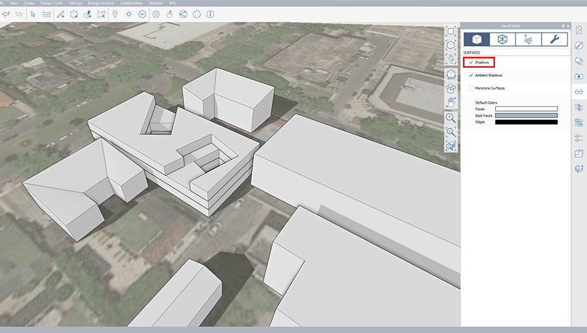
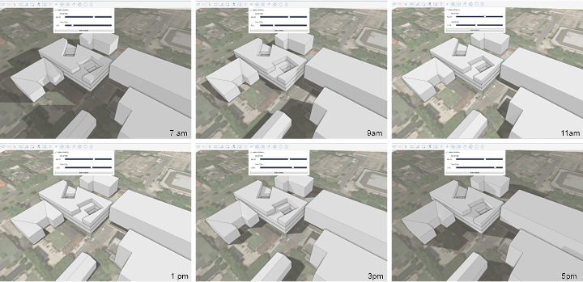

### Shadows
---
> This feature allows you to accurately study the effects of the sun path on your project. You will be able to predict how context will effect your project and vise versa.  

---
The first step for accurate shadows studies is to [**set your project location**](../tool-library/setting-location.md). Once you have set your location and imported the scaled image; model your project, context, and trees. For quick studies try using the [**Content Library Palatte**](../formit-introduction/tool-bars.md) to bring existing context models. 

- Next step is to make sure you have shadows turned on. This can be found in the [**Visual Styles Palette**](../formit-introduction/tool-bars.md).

- Click the *Sun and Shadows Button* in the [**Action Tool Bar**](../formit-introduction/tool-bars.md). This will give you a box that allows you to adjust date and time.

- You can then export screen shots of your studies for presentation and even animate them with the use of scenes. 
