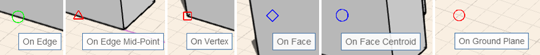

# Snaps and Inferences

To make sketching and modeling easier, use snaps and inference points to accurately create, place, and edit geometry. You can use whatever axis you choose as the axis on which to draw or execute another action, such as extruding a surface.

**Note:** _See_ [_Keyboard Shortcuts_](../appendix/keyboard-shortcuts.md) _for information about how to speed up your use of the software's tools._

## Snapping

There are several snaps that can aid you while you are sketching and modeling. Snapping to objects is automatically enabled, and you can snap to:

* On Edge
* On Midpoint
* Endpoints \(on vertex\)
* On Face
* Center of Face
* On Ground Plane

To snap to the grid, you must enable the **Snap to Grid \(SG\)** toggle from the Settings menu.

## Inference Points

Automatic selection of inference points is always enabled and will help you constrain the movement of geometry.

**Axis:** You can move geometry along the X, Y, or Z axis. The X-axis inference is red, the Y-axis is green, and the Z-axis is blue.

**Axis Locking:** You can lock movement along the X, Y, or Z axis. Hold down the Shift key while on an axis inference, then move your mouse to snap and inference to other elements.

**Parallel:** You can sketch or move geometry parallel to existing elements. Perpendicular inferences are purple. You need to hover your cursor over a line you want to use as a parallel reference.

**Perpendicular:** You can also draw or move geometry perpendicular to existing elements. Perpendicular inferences are purple. You need to hover your cursor over a line you want to use as a perpendicular reference.

**Extending from a point:** You can also use inferences to extend from a point reference. Hover the mouse over a point you want to use as a reference until the tooltip appears, then use the inference axis that extends from the point.

