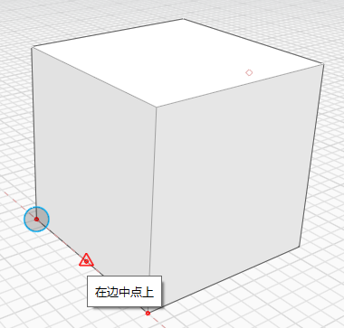
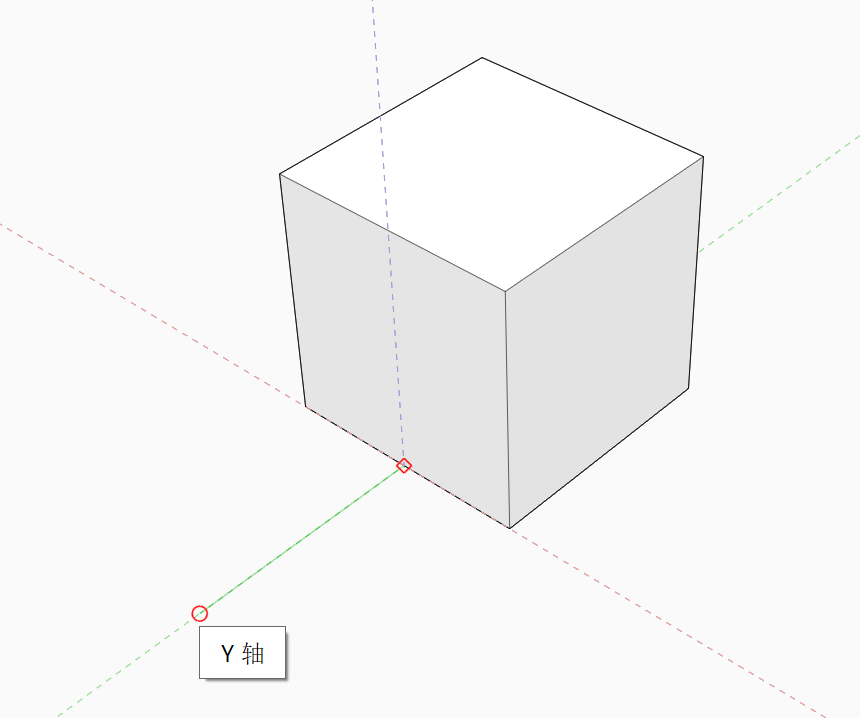

# Uchopení a odvození

Chcete-li si usnadnit kreslení a modelování, používejte k přesnému vytvoření, umístění a úpravě geometrie body uchopení a odvození. Jakoukoli zvolenou osu můžete použít jako osu pro kreslení nebo provedení jiné akce, například vysunutí povrchu.

**Poznámka:** _Informace o tom, jak urychlit používání nástrojů softwaru, najdete v části_ [_Klávesové zkratky_](../appendix/keyboard-shortcuts.md)_._

## Uchopení

Při vytváření náčrtů a modelování vám může pomoci několik uchopení. Přichytání k objektům je automaticky povoleno a přichytit se můžete k následujícím prvkům:

|                                                                                                                                                                            |                                            |
| -------------------------------------------------------------------------------------------------------------------------------------------------------------------------- | ------------------------------------------ |
| Vrcholy |  (2).png>) |
| Hrany. Při umístění kurzoru nad hranu se na koncích a ve středovém bodu zabrazí malé červené tečky. |  |
| Středové body hrany |  |
| Rovina plochy. Při umístění kurzoru nad plochu se v těžišti plochy zobrazí malý červený bod. To vám usnadní nalezení bodu, pokud k němu chcete provést přichycení. |  |
| Těžiště ploch |  |
| Pracovní rovina, pokud neprovedete přichycení k jinému prvku. |  |
| Středy kružnic nebo oblouků |  |
| Vrcholy sítě |  |
| Rovina plošky sítě. |  |

Chcete-li provést přichycení k osnově, je nutné v nabídce Nastavení povolit možnost **Přichytit k osnově (SG)**.

## Osy a body odvození

Automatický výběr bodů odvození je vždy povolen a pomůže vám omezit pohyb geometrie. Osy odvození se generují automaticky pomocí nástrojů nebo při umístění ukazatele myši nad hrany nebo body. Osy odvození jsou na obrazovce vždy nakresleny čárkovaně, abyste věděli, kde jsou, a mohli k nim snadno provést přichycení.

**Osa:** Geometrii lze posunovat podél osy X, Y nebo Z. Osa X je červená, osa Y je zelená a osa Z je modrá.

**Uzamknutí osy:** Pohyb můžete uzamknout podél osy X, Y nebo Z. Když jste na ose odvození, podržte klávesu Shift a poté pohybem myši proveďte přichycení a odvození k jiným prvkům.

**Rovnoběžné:** Geometrii můžete nakreslit nebo přesunout rovnoběžně s existujícími prvky. Kolmá odvození jsou fialová. Je třeba umístit kurzor na čáru, kterou chcete použít jako rovnoběžnou referenci.

**Kolmé:** Můžete také nakreslit nebo přesunout geometrii kolmo k existujícím prvkům. Kolmá odvození jsou fialová. Je třeba umístit kurzor na čáru, kterou chcete použít jako kolmou referenci.

**Prodloužení z bodu:** Pomocí odvození můžete také provést prodloužení z referenčního bodu. Přesuňte ukazatel myši nad bod, který chcete použít jako referenci, dokud se nezobrazí popisek nástroje, a poté použijte osu odvození, která vede z tohoto bodu.

**Střed kružnice:** Chcete-li provést přichycení ke středu oblouku nebo kružnice, přesuňte ukazatel myši nad oblouk nebo kružnici. Uprostřed se zobrazí malá červená tečka, která zůstane viditelná po dobu asi 5 sekund poté, co kurzor z oblouku nebo kružnice přesunete pryč. Nyní přesuňte kurzor nad tuto červenou tečku a proveďte přichycení ke středu.

**Skutečné středové body oblouků a spline:** Při umístění kurzoru nad kružnici, oblouk nebo spline se budete moci přichytit ke skutečnému středovému bodu. Tento bod a koncové body budou zobrazeny malou červenou tečkou. Při odvozování na oblouk se také přichytíte k vrcholům přímých hran, které představují oblouk.

**Odstranění odvození:** Je možné, že kreslení vygeneruje větší počet odvození, což může vadit v umístění bodů, které se nemají k těmto odvozením přichytit. Pokud stisknete klávesy **Shift+mezerník**, budou všechna odvození smazána, kromě těch, které se nacházejí v posledním umístěném bodě.

