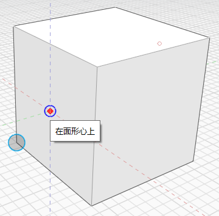
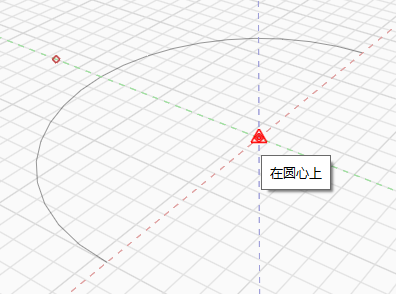

# Forzados de cursor y deducciones

Para facilitar el boceto y el modelado, utilice forzados de cursor y puntos de deducción para crear, colocar y editar la geometría con precisión. Puede utilizar el eje que elija como aquel en el que dibujar o ejecutar otra acción, como la extrusión de una superficie.

**Nota** _Consulte_ [_Métodos abreviados de teclado_](../appendix/keyboard-shortcuts.md) _para obtener información sobre cómo agilizar el uso de las herramienta del software._

## Forzado de cursor

Existen varios forzados de cursor que pueden ayudarle durante la creación de bocetos y el modelado. El forzado de cursos se activa automáticamente y puede forzar el cursor a los siguientes elementos:

|                                                                                                                                                                            |                                            |
| -------------------------------------------------------------------------------------------------------------------------------------------------------------------------- | ------------------------------------------ |
| Vértices. |  (2).png>) |
| Bordes. Al colocar el cursor en el borde, se dibujarán pequeños puntos rojos en los
        extremos y en el punto medio. |  |
| Puntos medios de bordes. |  |
| El plano de una cara. Al colocar el cursor en la cara, se dibujará un pequeño punto rojo
        en el centro de la cara. Esto hará que sea fácil encontrar ese punto
        si desea forzar el cursor a él. |  |
| Centroides de caras. |  |
| El plano de trabajo, si no se fuerza el cursor a otro elemento. |  |
| Centros de círculos o arcos. |  |
| Vértices de malla. |  |
| El plano de una faceta de malla. |  |

Para forzar el cursor a la rejilla, debe activar el conmutador **Forzar cursor a rejilla (SG)** en el menú Configuración.

## Puntos y ejes de deducción

La selección automática de puntos de deducción siempre está activada y le ayudará a restringir el desplazamiento de la geometría. Las herramientas generan automáticamente ejes de deducción o al colocar el cursor sobre los bordes o los puntos. Los ejes de deducción siempre se dibujan en la pantalla con guiones para que sepa dónde se encuentran y sea fácil detectarlos.

**Eje:** puede desplazar la geometría a lo largo del eje X, Y o Z. La deducción del eje X es roja, la del eje Y es verde y la del eje Z es azul.

**Bloqueo del eje:** puede bloquear el desplazamiento a lo largo del eje X, Y o Z. Mantenga pulsada la tecla Mayús mientras se encuentra en una deducción de eje y, a continuación, mueva el cursor para forzarlo y realizar deducciones en otros elementos.

**Paralelo:** puede crear un boceto o desplazar la geometría de forma paralela a los elementos existentes. Las deducciones perpendiculares son púrpura. Es necesario colocar el cursor sobre una línea que se desea utilizar como referencia paralela.

**Perpendicular:** también puede dibujar o desplazar geometría de forma perpendicular a los elementos existentes. Las deducciones perpendiculares son púrpura. Es necesario colocar el cursor sobre una línea que se desea utilizar como referencia perpendicular.

**Extensión desde un punto:** también puede utilizar las deducciones para la extensión desde una referencia de punto. Coloque el cursor sobre un punto que desee utilizar como referencia hasta que aparezca la información de herramientas y, a continuación, utilice el eje de deducción que se extiende desde el punto.

**Centro del círculo**: si desea forzar el cursor al centro de un arco o un círculo, coloque el cursor en uno de estos elementos. Se mostrará un pequeño punto rojo en el centro. Permanecerá visible durante unos 5 segundos después de alejarse del arco o círculo. Ahora mueva el cursor sobre el punto rojo para forzarlo al centro.

**Puntos medios reales de arcos y splines**: al pasar el cursor sobre un círculo, un arco o una spline, podrá forzar el cursor al punto medio real. Este punto y los puntos finales se mostrarán con un pequeño punto rojo. Al realizar la deducción en un arco, también forzará el cursor a los vértices de los bordes rectos que presentan el arco.

**Borrado de deducciones**: es posible que al dibujar se genere un mayor número de deducciones, lo que puede estorbar la colocación de puntos que se supone que no deben forzar el cursor a esas deducciones. Si pulsa las teclas de **Mayús + barra espaciadora**, se borrarán todas las deducciones, excepto las que se encuentren en el último punto colocado.

