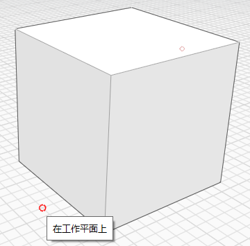

# Snaps and Inferences

To make sketching and modeling easier, use snaps and inference points to accurately create, place, and edit geometry. You can use whatever axis you choose as the axis on which to draw or execute another action, such as extruding a surface.

**Note:** _See_ [_Keyboard Shortcuts_](../appendix/keyboard-shortcuts.md) _for information about how to speed up your use of the software's tools._

## Snapping

There are several snaps that can aid you while you are sketching and modeling. Snapping to objects is automatically enabled, and you can snap to:

|                                                                                                                                                                            |                                        |
| -------------------------------------------------------------------------------------------------------------------------------------------------------------------------- | -------------------------------------- |
| Vertices                                                                                                                                                                   | .png>) |
| Edges. When hovering over the edge, small red dots will be drawn at the ends and at the mid point.                                                                         |        |
| Edge mid points                                                                                                                                                            |        |
| The plane of a face. When hovering over the face a small red dot will be drawn at the face centroid. This will make it easy to find that point, if you want to snap to it. |        |
| Face centroids                                                                                                                                                             |        |
| The work plane, if you don't snap to anything else.                                                                                                                        |        |
| Circle or arc centers                                                                                                                                                      |        |
| Mesh vertices                                                                                                                                                              |        |
| The plane of a mesh facet.                                                                                                                                                 |        |

To snap to the grid, you must enable the **Snap to Grid (SG)** toggle from the Settings menu.

## Inference Axes and Points

Automatic selection of inference points is always enabled and will help you constrain the movement of geometry. Inference axes are generated by tools automatically or when you hover the mouse over edges or points. Inference axes are always drawn on the screen with dashes so that you know where they are and are easy to snap to.

**Axis:** You can move geometry along the X, Y, or Z axis. The X-axis inference is red, the Y-axis is green, and the Z-axis is blue.

**Axis Locking:** You can lock movement along the X, Y, or Z axis. Hold down the Shift key while on an axis inference, then move your mouse to snap and inference to other elements.

**Parallel:** You can sketch or move geometry parallel to existing elements. Perpendicular inferences are purple. You need to hover your cursor over a line you want to use as a parallel reference.

**Perpendicular:** You can also draw or move geometry perpendicular to existing elements. Perpendicular inferences are purple. You need to hover your cursor over a line you want to use as a perpendicular reference.

**Extending from a point:** You can also use inferences to extend from a point reference. Hover the mouse over a point you want to use as a reference until the tooltip appears, then use the inference axis that extends from the point.

**Circle Center**: If you want to snap to the center of an arc or circle, hover over the arc or circle. This will show a small red dot at the center. It will stay visible for about 5 seconds after you move away from the arc or circle. Now move the cursor over the red dot to snap to the center.

**True arc and spline midpoints**: When you hover over a circle, arc or spline you will be able to snap to the true midpoint. It and the end points will be shown by a small red dot. When inferencing on an arc you will also snap to the vertices of the straight edges that represent the arc.

**Clearing inferences**: It is possible that drawing will generate a larger number of inferences, which may be in the way of placing points that are not supposed to snap to those inferences. If you press he **Shift + Spacebar** keys, all inferences will be cleared, except for those at the last placed point.

