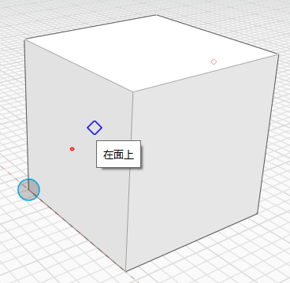
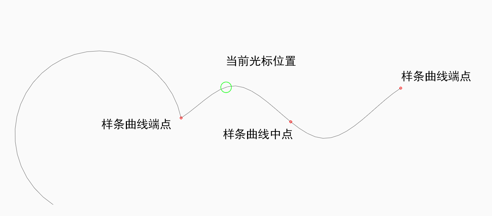

# スナップと推定配置点

スナップと推定配置点を使用すると、スケッチとモデリングを簡単に実行できるだけでなく、ジオメトリの作成、配置、編集も正確に行うことができます。描画を行う軸として、任意の軸を選択して使用することができます。この軸で、サーフェスの押し出しなどの操作を実行することもできます。

**注:** _ソフトウェアの各種ツールを使用する場合に便利な_ [_キーボード ショートカット_](../appendix/keyboard-shortcuts.md) _に関する情報を参照してください。_

## スナップする

スケッチやモデリングを行う際に、いくつかのスナップを使用することができます。オブジェクトへのスナップは、自動的に有効になります。次に示すスナップ先にスナップすることができます。

|                                                                                                                                                                            |                                            |
| -------------------------------------------------------------------------------------------------------------------------------------------------------------------------- | ------------------------------------------ |
| 頂点 |  (2).png>) |
| エッジ。エッジにカーソルを合わせると、両端と中点に小さな赤い点が表示されます |  |
| エッジの中点 |  |
| 面の平面。面にカーソルを合わせると、面の図心に小さな赤い点が表示されます。これにより、図心にスナップする場合に簡単に見つけることができます |  |
| 面の図心 |  |
| 作業面(他のどの要素にもスナップしない場合) |  |
| 円または円弧の中心 |  |
| メッシュの頂点 |  |
| メッシュのファセットの平面 |  |

グリッドにスナップするには、[設定]メニューの**[グリッドにスナップ(SG)]**をオンにします。

## 推定軸と推定配置点

推定配置点の選択機能は常に有効になっているため、ジオメトリの動作を制限できます。推定軸は、ツールによって自動的に生成されるか、マウスをエッジまたは点の上に合わせたときに生成されます。推定軸は常に破線で画面に描画されるため、位置が分かり、スナップが簡単です。

**軸:** X 軸、Y 軸、Z 軸に沿ってジオメトリを移動することができます。 X 軸の推定配置点は赤、Y 軸の推定配置点は緑、Z 軸の推定配置点は青で表示されます。

**軸のロック:** X 軸、Y 軸、Z 軸に沿って動作をロックすることができます。 軸の推定配置点で[Shift]キーを押したまま、マウスを移動して別の要素の推定配置点にスナップします。

**平行:** 既存の要素に対して平行に、ジオメトリのスケッチや移動を行うことができます。 垂直方向の推定配置点は紫色で表示されます。水平方向の参照情報として使用する線にマウス カーソルを置く必要があります。

**垂直:** 既存の要素に対して垂直に、ジオメトリのスケッチや移動を行うこともできます。 垂直方向の推定配置点は紫色で表示されます。垂直方向の参照情報として使用する線にマウス カーソルを置く必要があります。

**任意の点からの延長:** 推定配置点を使用して、任意の点参照から延長することができます。 参照情報として使用する点にマウス カーソルを置いてツールチップを表示し、その点から伸びる推定軸を使用します。

**円の中心**: 円弧または円の中心にスナップする場合は、円弧または円の上にカーソルを合わせます。これにより、中心に小さな赤い点が表示されます。円弧または円からカーソルを離しても、約 5 秒間は表示されたままです。カーソルを赤い点の上に移動して、中心にスナップします。

**円弧とスプラインの真の中点**: 円、円弧、またはスプラインにカーソルを合わせると、真の中点にスナップできます。この中点と両端の点は、小さな赤い点で示されます。円弧の推定配置には、円弧を表す直線エッジの頂点も含まれます。

**推定配置をクリアする**: 描画中は多数の推定配置が生成される可能性があり、それらの推定配置にスナップしない点を配置する際の妨げになる可能性があります。**[Shift]+[Space]**キーを押すと、最後に配置された点の推定配置以外はすべてクリアされます。

